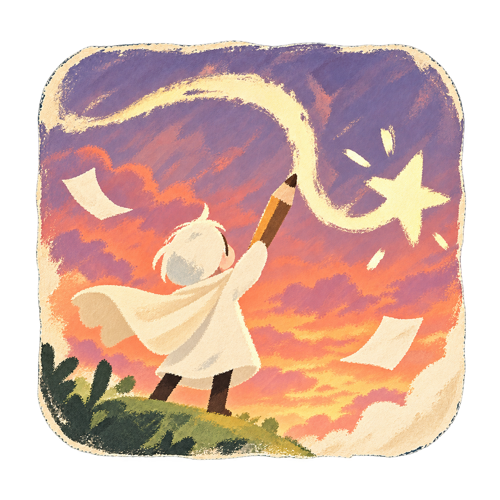

  

# The Tale We Drew

**Draw something. Help someone.**

A storybook adventure by **Four Otters**, made during a four-day game jam.

Follow a painted mountain trail, meet the creatures who live along it, and sketch
objects to help you find a way forward. Your drawings take shape as 3D objects,
while conversations with an otter and the mysterious Storykeeper become part of
your journey.

> Formerly developed as **Paws & Peaks**. The repository retains its original
> name, `Paws-Peaks`; the game's official title is **The Tale We Drew**.

## Play

[Open the game](https://the-tale-we-drew.vercel.app)

**Release status:** The public game URL is available. Full hosted playthrough verification is ongoing.

Use a desktop browser with WebGL 2 support; desktop Chrome is the initial target.
The first download is large and may take a while. Enable sound for narration and
music, and allow microphone access if you want to speak to the characters.

No installation or personal API key is required to play the hosted game.

## Gameplay video

A short gameplay demo follows the journey from sketches to the storybook world.

[Watch the gameplay demo on Google Drive](https://drive.google.com/file/d/1DkSfG2fj2KFqbJWi1iHfrXBio6elNaGm/view?usp=sharing)

## A journey in five chapters

Cross a river, encounter a large dog, face the birds of Wind Hill, visit an otter
at Sunset Cove, and meet the Storykeeper in the moonlit forest.

- Draw directly over the scene and watch your ideas become objects in the world.
- Explore hand-painted environments with animated characters.
- Speak or type during conversations in the final two chapters.
- Follow voiced narration, music, and storybook page turns through the journey.

## How to play

| Action | Control |
| --- | --- |
| Move | WASD or arrow keys |
| Jump | Space |
| Draw | Click the brush, then drag with the left mouse button |
| Clear your sketch and redraw | Click the X |
| Submit your sketch | Click the checkmark |
| Put the sketch away | Click the brush again |
| Speak in Chapters IV and V | Click the microphone and follow the recording controls |
| Menu and audio settings | Click the menu icon |

AI generation can take several minutes. Keep the game open while it finishes.
A drawing's interpretation and generated shape can vary between attempts.

## Made by Four Otters

| Team member | Role | GitHub | LinkedIn |
| --- | --- | --- | --- |
| Yanwen Chen | Developer | [AdeDeepFishing](https://github.com/AdeDeepFishing) | [LinkedIn](https://www.linkedin.com/in/yanwen-chen-1001001/) |
| Beichun Qi | Developer | [beichun-dev](https://github.com/beichun-dev) | [LinkedIn](https://www.linkedin.com/in/beichun-qi/) |
| Weijie Zong | Designer | [zongweijie](https://github.com/zongweijie) | [LinkedIn](https://www.linkedin.com/in/zongweijie/) |
| Han Meng | Designer | [mhxyz](https://github.com/mhxyz) | [LinkedIn](https://www.linkedin.com/in/hanmon/) |

## Built with

- **Godot 4.7.2 Standard** and GDScript for the game.
- **Python** for the AI backend.
- **OpenAI** for drawing interpretation, reference-image generation, and dialogue.
- **Meshy** for generated 3D models.
- **ElevenLabs** for speech generation and transcription.
- **Vercel** for the game website and **Render** for the backend.

Provider credentials stay on the backend and are not included in the game export.

## Two ways to play

**In your browser:** open the hosted game above; no setup is required.

**From source on your computer:** use Godot and the Python backend as described
below. This is a developer setup, not a downloadable standalone app.

### Run locally

1. Clone this repository.
2. Import `3d_game/project.godot` in Godot 4.7.2 Standard.
3. Follow the [backend setup guide](docs/backend/BACKEND.md#setup-and-run) to configure
   Python and your local, ignored `backend/.env`.
4. Press **F5** in Godot to start the game.

Local live AI requires your own provider credentials and uses provider credits.
See [desktop integration](docs/3d_game/DESKTOP_GENERATION.md) for backend connection
details and offline development options.

## Hosting and current limitations

The browser runs the game on Vercel and requests AI results from the Render
backend. See the [Web deployment guide](docs/3d_game/WEB_DEPLOYMENT.md) for setup.

- The free backend may sleep when idle, so the first connection can take about a minute.
- Backend restarts can discard the current server session and generated files.
  Reloading starts a new session; progress is not a durable cloud save.
- Hosted AI availability depends on provider credits and service limits.
- Mobile browsers have not been qualified.

## Project documentation

- [Game specification](docs/SPEC.md)
- [Backend setup and API contracts](docs/backend/BACKEND.md)
- [Web deployment](docs/3d_game/WEB_DEPLOYMENT.md)
- [Narration and dialogue](docs/3d_game/NARRATOR_AGENT.md)
- [Audio integration](docs/3d_game/AUDIO.md)

## Credits and acknowledgments

- **Godot Engine** — MIT License.
- **Brackeys' 3D Game in Godot / ProtoController** — starter foundation, CC0 1.0.
- **Cormorant Upright** — title typography, SIL Open Font License 1.1.
- **Three.js** — MIT; used in source scene-generation workflows, with no Three.js
  runtime in the Godot game.
- **OpenAI / ChatGPT, Meshy, and ElevenLabs** — proprietary AI services used
  during development and gameplay. Team-directed visual assets, animations, and
  music include AI-generated material.
- **ElevenLabs Voice Library:** Elariel X – Epic Queen Ethereal (narrator), and
  Lulu Lolipop – High-Pitched and Bubbly (otter).

See the [credits and source notes](docs/CREDITS.md) for the repository audit,
source notices, and submission wording. Third-party components and assets retain
their respective licenses and notices; this README does not grant a blanket
license to all materials.
