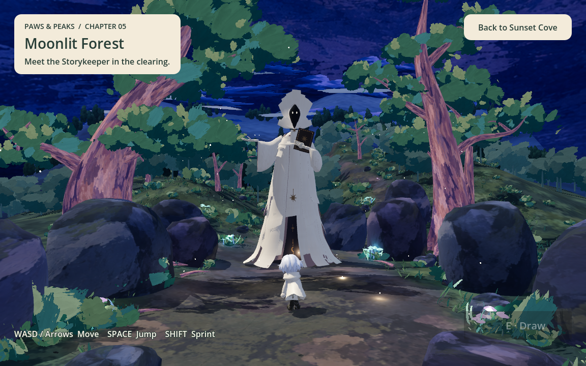
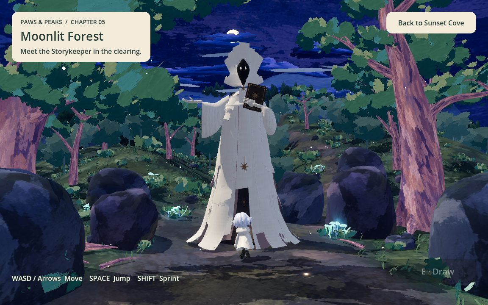

# Giant Storykeeper visual

> Test consolidation: test names and results below describe historical verification. See [Testing](TESTING.md) for the current stage suites and coverage; retired scripts are no longer runnable.

Updated: 2026-09-14. Implements the supplied Stage 5 boss appearance for #36.
The separate personality/agent requirements (#63) are explicitly deferred.

## In-game presentation

The Storykeeper stands at world (0, ground height, -6) in Moonlit Forest's
central clearing, facing the arriving protagonist. Its model scale is 1.6,
giving an authored height of approximately 11.1 world units: about six times
the 1.84-unit protagonist. The large figure, raised hand and book remain visible
in the existing 52-degree camera both on arrival and at close approach.
No extra light, camera change or alteration to the supplied model is needed.

The reusable scene aligns its feet to the terrain after the first physics
frame. A static capsule prevents walking through its body; decorative sleeves
and the hand/book do not add small snagging colliders. The capsule is 2.1 units
in radius and 9.6 units tall. Players can walk around the body.
The existing preview ending still triggers at z <= -12; walk around the boss
and return to the central path behind it to avoid the forest's scenery rocks.
This shortcut does not represent defeating the boss.





## Source and import

- Team-supplied source: `Downloads/boss-Storykeeper-HandLift-Sway-Loop-v01.glb`.
- Runtime asset: `3d_game/models/boss/storykeeper.glb`, copied byte-for-byte.
- SHA-256: `949bee32601c58ae5f5cbf7370533516db7d38e7b7b689a27ab0b2a482b50855`.
- Size: 6,664,580 bytes; 148 meshes, 104,970 triangles, 11 materials and one
  embedded manuscript PNG. The source was exported by Blender's glTF exporter.
- Godot's extracted manuscript PNG is committed beside the model. The model
  retains its paper, ink, leather, gold, dark face and emissive eye materials.
- The three-bone rig retains the four-second
  `Storykeeper_RightHandLift_BodySway_Loop` source animation. Godot's name-suffix
  importer removes `_Loop`; the wrapper plays a local looping copy of
  `Storykeeper_RightHandLift_BodySway` without editing the source animation.
- No additional license statement accompanied this delivery. No external art
  or paid generation calls were used. The game does not read Downloads at runtime.

## Character folders

Keep each character's GLBs, textures and Godot import settings together under
`3d_game/models/<character>/`. Existing examples are `hero/`, `wolfdog/`, and
`bird/`; this delivery adds `boss/`.

The boss's reusable gameplay wrapper is
`3d_game/scenes/boss/storykeeper.tscn`, and its presentation script is
`3d_game/scripts/boss/storykeeper.gd`. Moonlit Forest instances that wrapper.
Keep integration notes and source credits under `docs/3d_game/`; screenshots
live under `docs/assets/`. Future personality logic should remain separate
from this asset wrapper and follow the agreed #63 design.

## Verification and remaining scope

- `boss_smoke.gd`: delivered mesh/rig counts, terrain grounding, giant scale,
  active idle, body and hand movement, loop continuity, and real player walking
  into the solid body. Passed in Godot 4.7.2 headless.
- `moonlit_forest_smoke.gd`: Stage 4-to-5 transition, arrival landing, original
  forest assets and motion, walking, jumping, fall recovery and return. Passed
  with native Forward+ on Apple M1. The test now allows the arrival drop to land
  after the map transition before asserting grounded state.
- `ending_smoke.gd`: real walking around the boss to the preview ending, victory
  book, replay, return, disabled preview gate and explicit future victory hook.
  Passed headless. The previous straight route now correctly meets the boss's
  collider, so this test follows a short detour.
- `boss_visual.gd`: native arrival and close-up captures inspected for scale,
  framing, materials and ground contact. Add `-- --preview` to leave it open.

One headless forest transition run crashed inside Godot's scene loading during
the map switch. The native transition run passed; headless/native navigation
runs also reported existing ObjectDB cleanup warnings. These engine-level
diagnostics are not treated as clean passes for those failed runs. Web export
and browser performance have not been tested for this asset.

The original #36 asset delivery did not implement personality or victory.
The follow-up [narrator integration](NARRATOR_AGENT.md) adds dialogue, drawing
interpretation, release and confirmed stay endings. Combat is not part of this design.

```sh
godot --headless --path 3d_game --script res://tests/boss_smoke.gd
godot --headless --path 3d_game --script res://tests/ending_smoke.gd
godot --path 3d_game --script res://tests/boss_visual.gd
```

## September 14 evening update (#72, partial)

The active model is now the team-delivered `Storykeeper-CharacterPageCycle-v05.glb`,
stored as `3d_game/models/boss/storykeeper_page_cycle.glb`. It retains the giant
1.6 visual scale and includes the 6.2-second `BlockPageCycle` flying-paper clip.
Negative Chapter 5 mood results use the `angry` emotion and play this clip once;
then the model returns to its authored first-frame pose. The prior rig's idle is
not retargeted to this different skeleton. Additional idle/turn clips remain a
future designer delivery.

Release rotates the entire body 90 degrees over 1.8 seconds without translation.
A thin box collider rotates with it, opening space beside the boss. No synthetic
skeletal turn is claimed. Earlier-stage narrator tone remains warm; Stage 5 is
proud and easily irritated, with negative mood changes for dismissiveness or
hostility, not for drawing quality or innocent misunderstandings.

## September 15 behavior delivery (#67)

The supplied sway, entrance page cycle, furious pages and satisfied/heart
performances now drive the boss reactions. They supersede the paused first-frame
idle and single anger cycle above. See [Character behaviors](CHARACTER_BEHAVIORS.md)
for mappings, unavailable gestures, and focused verification.
