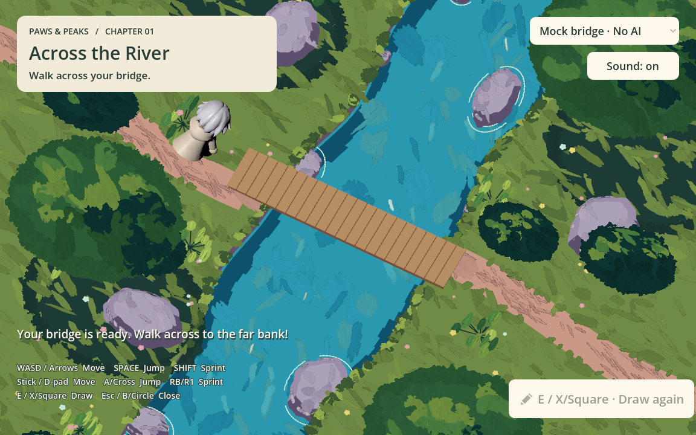

# Construction, rewards, and accessible crossing

## Agreed flow (issue #37, September 13)

Submitting a drawing starts generation immediately. The construction cloth now
appears at the authored bridge location, so the waiting and final crossing shots
share a focus. The camera keeps its overhead orientation and eases from normal
size 18.6 to size 12 over two seconds. It holds that framing for the entire request;
it no longer returns to exploration framing while the object is unfinished.
After the opening move, normal controls and the Stop waiting action are available,
but camera following remains suspended until the result or cancellation.

Once the result is ready, the cloth is removed and the object is revealed. The
finished object stays in closeup for two full seconds, followed by a one-second
return to the captured normal framing. Fast results wait for the opening camera
move before being revealed. An unsuitable generated object can be shown at its
placement location before returning; an unsuitable mock result returns immediately.
Failures and cancellation restore the camera and input and remove the cloth.
Escape also cancels during the opening shot or the held wait. Restart invalidates
old camera continuations and resets the 18.6-unit overview.

Coins have been removed from active gameplay globally: no pickup nodes, release
animations, collection logic, counters, or pickup sounds remain. The old eight-coin
reward sequence and sampling rules are superseded, not hidden for later release.
The reference dungeon assets remain separate from the active game.

## Movement

The stage retains a fixed overhead angle and keyboard movement relative to that angle.
Near the bridge, input is projected onto the crossing axis with gentle lateral
centering. One right/down input toward the far bank can cross; release stops, reverse
walks back. Land movement stays free. The generated visual is aligned using its dominant
horizontal surface rather than the highest railing, and the authored collision width
is adjusted to the model. Collision remains a simplified gameplay deck, not an exact
reconstruction of arbitrary curved meshes.

The old stage boundary at z=2 blocked walking at approximately z=1.33 even though the
imported meadow continued beyond it. Boundaries now sit near the imported terrain's
outer extent. The camera pans when the player approaches the screen edges while
preserving its overhead angle. Rocks, tree trunks, water, and map edges still constrain
movement intentionally; no global removal of terrain or prop collision was made.

## Backend update

Merged PR #17 locally and preserved the desktop progress callback and output folder
contract. The current default is OpenAI 816px image editing followed by Meshy T2.
The teammate's documented comparison measured 26.664s versus 19.700s for one pair
of runs; this is not a latency guarantee. No paid generation was needed for this change.

## Bridgehead and framing update (#37)

The supplied `Lavender_boulder_06` intersected the far end of the bridge: its world
bounds covered x=3.84..6.84, z=-7.76..-4.32. Its mesh and `..._dry_brush` overlay
are independent and have no animation tracks. Both move by world `(5, 0, -5)`
before collision is generated. The original GLB remains unchanged; the stone
retains its painted surface and solid collision at its new position beside the
far-bank vegetation, away from the bridge and onward path.

The normal orthographic size changes from 22 to 18.6, making the view approximately
18.3% larger. The Stage 1 protagonist uses `appearance_scale = 2.0`; its shared
controller and collision dimensions are preserved. Other stages retain their
existing character sizes. Camera following also continues on the far bank so the
closer framing does not hide the route toward Stage 2.

## Verification

Godot 4.7.2, Apple M1, offline checks:

- `encounter_flow_smoke.gd`: moved rock/paint/collision, bridgehead clearance,
  zoom and visual scale, held slow requests, fast-result ordering, two-second
  finished-object hold, stop/reverse/cross input, cancel/failure recovery,
  restart, no coin nodes, and the formerly blocked meadow route.
- `river_smoke.gd`: drawing, immutable PNG transport, request lifecycle, removal
  of pickups, recovery, and crossing.
- `stage_transition_smoke.gd`: crossing and onward travel to Stage 2.
- `hero_smoke.gd`: shared animation/movement and doubled Stage 1 visual.
- `desktop_generation_smoke.gd`: the offline Python worker, actual fixture GLB,
  request routing, stale/canceled responses and physical crossing.
- Desktop construction/wait/completion renders inspected, including stone
  placement and the normal closer framing.

No paid generation calls were made. Web generation remains separate.
