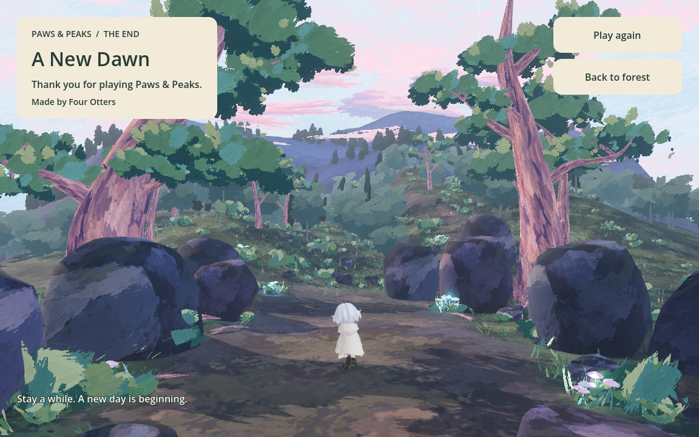

# Dawn ending integration

Updated: 2026-09-13. Implements the ending presentation requested in #52.

## Entry, replay and future boss integration

Stage 5's `EndingExit` enters `res://scenes/ending/dawn_forest.tscn` when the
player reaches world **z <= -12**. The boundary covers every X position and
height, so there is no small target to hit and jumping does not bypass it.
The clearing is reachable from the normal spawn by walking forward.

This is the user-approved temporary route while the boss is absent.
`moonlit_forest_level.gd` exports `preview_ending_enabled` (currently true).
When implementing #36, set that property false and call
`complete_boss_encounter()` after actual victory. The explicit hook uses the
same deferred, duplicate-guarded transition, independently of the walk gate.
No boss or combat victory is simulated by this integration.

The ending is an explorable morning epilogue with **THE END**, **A New Dawn**,
a thank-you line and the Four Otters team credit. It has no drawing prompt.
**Back to forest** returns to Stage 5's safe clearing spawn, before the exit.
**Play again** loads a fresh river scene with empty item/drawing/request state
and an unbuilt bridge. The generation worker stays alive across navigation;
these scene transitions submit no AI requests. Existing scene-local state is
fresh on restart; a future persistent story-state system must add its reset here.

The protagonist retains Stage 5's 1.08 visual scale, authored 52-degree lens,
three-unit camera pullback, movement, jumping and fall recovery. Terrain, rocks,
trunks, trail stones and buttress roots use the shared forest collision setup.



## Asset provenance and rendering

Source: the user's `Downloads/Ending/dawn-forest-v1.zip`, containing
`dawn-forest-v1/dawn-forest-painted.glb`. The unmodified GLB is stored as
`3d_game/models/ending/dawn_forest.glb`; all nine separately imported PNGs match
the corresponding embedded bytes.

SHA-256: `d48a79787a1332dfc25e7cf3f9172687a9dae3614a02a62f8512eb77154038e7`.

The 91,819,260-byte delivery contains 451 meshes, 878,776 triangles, nine PNGs,
11 lights, the reference camera and a 12-second animation with 284 channels.
It retains the V5 forest layout and changes the atmosphere to painted blue/pink
dawn, removing the moon and 62 fireflies. The source's stationary glowing garden
plants remain. No additional asset license grant was included; the archive's
editable Blender file, source browser implementation and vendor code remain
outside the game. There is no runtime dependency on Downloads or that HTML.

The shared forest art adapter now accepts animation name and key-light name
parameters. Stage 5 retains its existing defaults. Dawn selects
`Forest_dawn_wind_clouds` and `Sunrise_key`, reuses the native foliage wind and
mirrored sky/bark texture sampling, and disables shadow casting on sky/clouds.
Its non-seamless animation plays forward/backward to avoid an end-frame snap.
Directional and local lights retain the calibrated 50% / 30% energy scales;
dawn adds brighter ambient light and pale distance fog. Native lighting and
bloom approximate the supplied renderer rather than matching its pixels.

## Verification and remaining scope

`ending_smoke.gd` exercises actual forward walking from Stage 5 into the ending,
checks dawn assets, camera, animation and sky material, then verifies movement,
jumping/landing, fall recovery, return and fresh restart. It also checks a
disabled walking shortcut, explicit boss completion, repeated completion,
lateral/airborne boundary crossings and a single active world with the same
persistent worker. No live AI request is made.

```sh
godot --headless --path 3d_game --script res://tests/ending_smoke.gd
godot --headless --path 3d_game --script res://tests/woodland_exit_smoke.gd
godot --headless --path 3d_game --script res://tests/wind_hill_exit_smoke.gd
godot --headless --path 3d_game --script res://tests/moonlit_forest_smoke.gd
```

For a rendered playtest, omit `--headless` and append `-- --visual` to the first
command; it saves `/private/tmp/paws-ending.png`. Validation uses Godot 4.7.2
Forward+ on Apple M1. The shared exit regressions preserve the Stage 2 dog gate
and Stage 3 rock boundary; the night-forest regression checks unchanged V5 art
and the Stage 4-to-5 flow.

The final boss and its victory call site, voiced ending, full asset credits UI,
Web export and browser performance are not part of this implementation. The
large GLBs still need a Web delivery budget pass.
