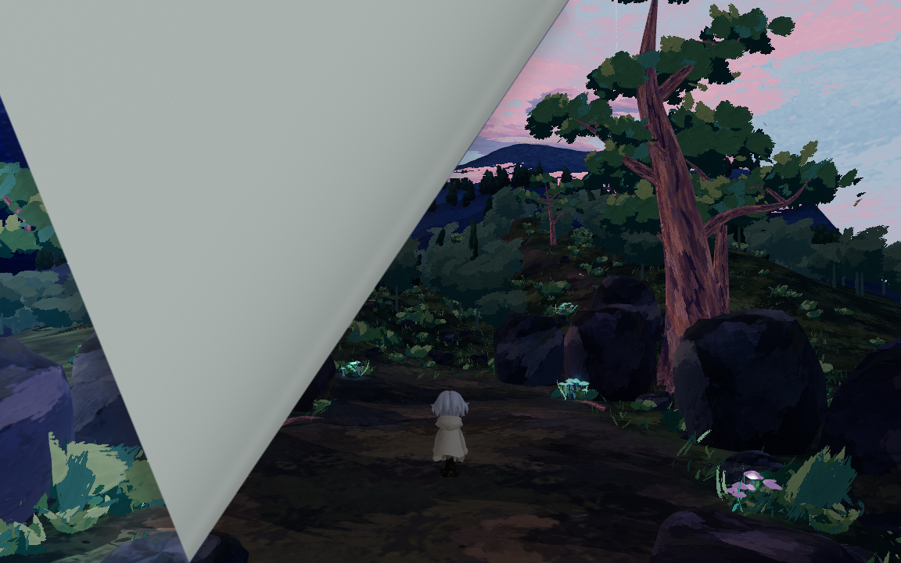
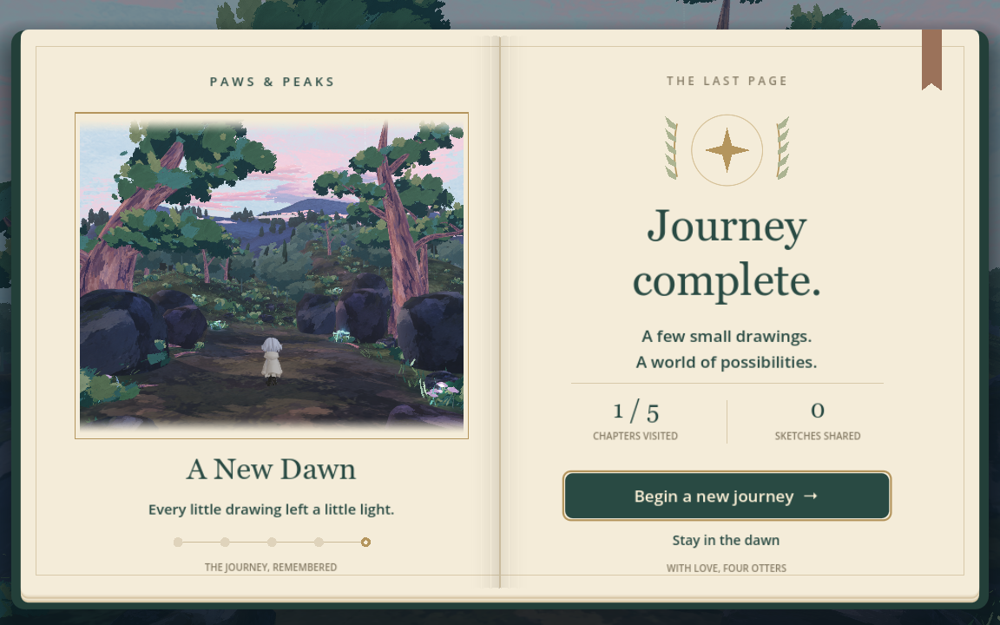
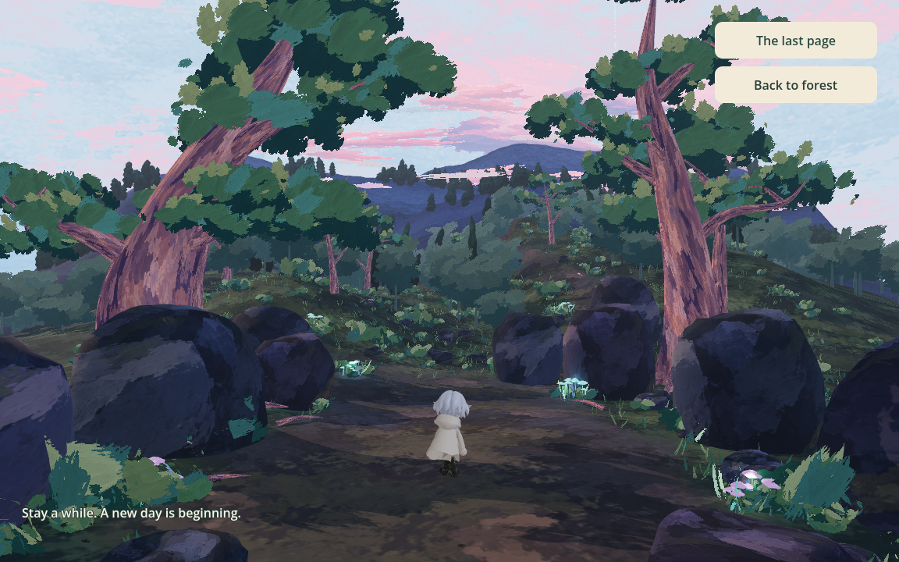

# Dawn ending integration

> Test consolidation: test names and results below describe historical verification. See [Testing](TESTING.md) for the current stage suites and coverage; retired scripts are no longer runnable.

Updated: 2026-09-14. Implements the supplied ending (#52) and the final-page
transition, gentler dawn and victory recap requested in #60.

## Entry, replay and future boss integration

Stage 5's `EndingExit` enters `res://scenes/ending/dawn_forest.tscn` when the
player reaches world **z <= -12**. The boundary covers every X position and
height, so there is no small target to hit and jumping does not bypass it.
Normal play now requires the #63 narrator to open the exit and an actual player
crossing. `preview_ending_enabled` defaults to false; authoring tests opt in explicitly.
`complete_boss_encounter()` is called only after the leave event commits. Choosing
and confirming a stay ending turns the final page into **A Place to Stay** in the
moonlit scene. See [Narrator integration](NARRATOR_AGENT.md).

The exit now fades the chapter HUD over 0.45 seconds, then curls the final page
for 1.65 seconds, lifting from the same bottom-right corner and angle used by
all map turns. A dim dawn lies beneath the outgoing night scene, with a muted
paper underside rather than a bright flash. Dawn light rises over 3.6 seconds;
the victory spread and a soft backdrop fade in over 0.8 seconds. Chapter exits
and final-page input are guarded against duplicate activation. The destination
loads in the background while the source scene remains visible.

The final spread reads **Journey complete.**, shows a keepsake captured from the
settled dawn, and displays the session's actual **Chapters visited** and
**Sketches shared**. Journey observes scene entry and each DrawingRequest's
existing `request_prepared` signal. Chapters are unique; accepted sketch
submissions include retries, while rejected/pending duplicates do not count.
These are local session counts, not encounter victories or successful AI jobs.
Direct Stage 5 previews consequently show 1/5 visited, not invented completion.
No drawing or screenshot data is sent to a provider by this presentation.

**Begin a new journey** clears the recap and returns to the daylight map and
**Start the journey** before a fresh river with empty encounter/drawing state.
**Stay in the dawn** (or Escape/controller cancel) dismisses the book and restores
movement without a confirm-button jump. **The last page** reopens the same
keepsake. **Back to forest** remains available during exploration, returning to
the safe Stage 5 clearing before the exit. The generation worker persists;
navigation makes no AI requests.

The victory spread uses native Godot controls and vector drawing, with a cloth
cover, layered paper edges, a shaded gutter, gold seal and route markers. The
keepsake is a session-only viewport texture. The UI scales as one composition;
buttons keep real focus/click behavior. Serif headings request installed Georgia,
Noto Serif or DejaVu Serif, with Godot's system fallback; no font files are bundled.

The protagonist retains Stage 5's 1.08 visual scale, authored 52-degree lens,
three-unit camera pullback, movement, jumping and fall recovery. Terrain, rocks,
trunks, trail stones and buttress roots use the shared forest collision setup.







## Asset provenance and rendering

Source: the user's `Downloads/Ending/dawn-forest-v1.zip`, containing
`dawn-forest-v1/dawn-forest-painted.glb`. The unmodified GLB is stored as
`3d_game/models/ending/dawn_forest.glb`; all nine separately imported PNGs match
the corresponding embedded bytes.

SHA-256: `d48a79787a1332dfc25e7cf3f9172687a9dae3614a02a62f8512eb77154038e7`.

The 91,819,260-byte delivery contains 451 meshes, 878,776 triangles, nine PNGs,
11 lights, the reference camera and a 12-second animation with 284 channels.
It retains the V5 forest layout and changes the atmosphere to painted blue/pink
dawn, removing the moon and 62 fireflies. The source's stationary glowing garden
plants remain. No additional asset license grant was included; the archive's
editable Blender file, source browser implementation and vendor code remain
outside the game. There is no runtime dependency on Downloads or that HTML.

The shared forest art adapter now accepts animation name and key-light name
parameters. Stage 5 retains its existing defaults. Dawn selects
`Forest_dawn_wind_clouds` and `Sunrise_key`, reuses the native foliage wind and
mirrored sky/bark texture sampling, and disables shadow casting on sky/clouds.
Its non-seamless animation plays forward/backward to avoid an end-frame snap.
Night retains its 50% / 30% directional/local light scales. Dawn uses 32% / 20%,
0.78 final exposure, 0.34 ambient energy, 0.24 glow intensity and 0.025 bloom.
Arrival starts at 0.46 exposure, 0.22 ambient energy and 65% of those dawn lights,
then eases toward the final values with cool fog gradually warming. Native lighting and
bloom approximate the supplied renderer rather than matching its pixels.

## Verification and remaining scope

`ending_smoke.gd` exercises actual forward walking from Stage 5 into the ending,
checks dawn assets, camera, animation, sky material, the victory-book input lock
and its exploration action, then verifies movement,
jumping/landing, fall recovery, return and fresh restart. It also checks a
disabled walking shortcut, explicit boss completion, repeated completion,
lateral/airborne boundary crossings and a single active world with the same
persistent worker. No live AI request is made.

```sh
godot --headless --path 3d_game --script res://tests/ending_smoke.gd
godot --headless --path 3d_game --script res://tests/woodland_exit_smoke.gd
godot --headless --path 3d_game --script res://tests/wind_hill_exit_smoke.gd
```

`journey_journal_smoke.gd` verifies real accepted submissions, rejected and pending
duplicates, partial chapter visits, displayed recap and replay reset.
`overworld_smoke.gd` covers all five map chapters and journal reset. The forest
regression waits for the map presentation before checking its destination.

`ending_visual.gd` captures the native night scene, midpoint page curl, dim arrival,
settled victory spread at 1152×720 and 850×720, restored exploration via a real
mouse click, and the reopened book. Append `-- --preview` to leave the victory
screen open for a manual playtest. Its captures are written under
`/private/tmp/map60-*.png`. Validation uses Godot 4.7.2
Forward+ on Apple M1. The shared exit regressions preserve the Stage 2 dog gate
and Stage 3 rock boundary; the night-forest regression checks unchanged V5 art
and the Stage 4-to-5 flow.

Full asset credits UI,
Web export and browser performance are not part of this implementation. The
large GLBs still need a Web delivery budget pass.


The final-page, journal, map-flow and night-forest checks run offline. Native
Forward+ validation covers both sizes and the actual final page/dawn sequence.
Godot 4.7.2's previously isolated threaded-resource cleanup warning remains;
see [map validation notes](OVERWORLD_INTEGRATION.md#verification).
