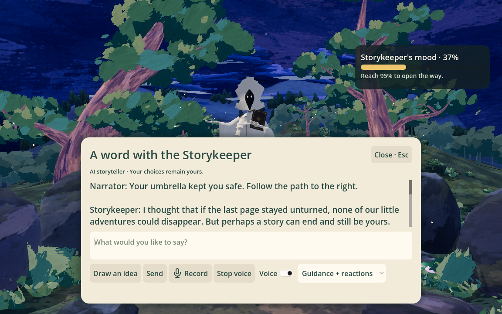
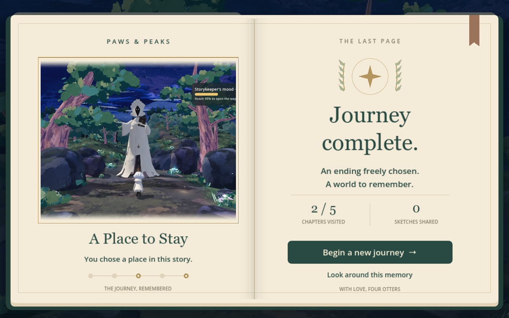
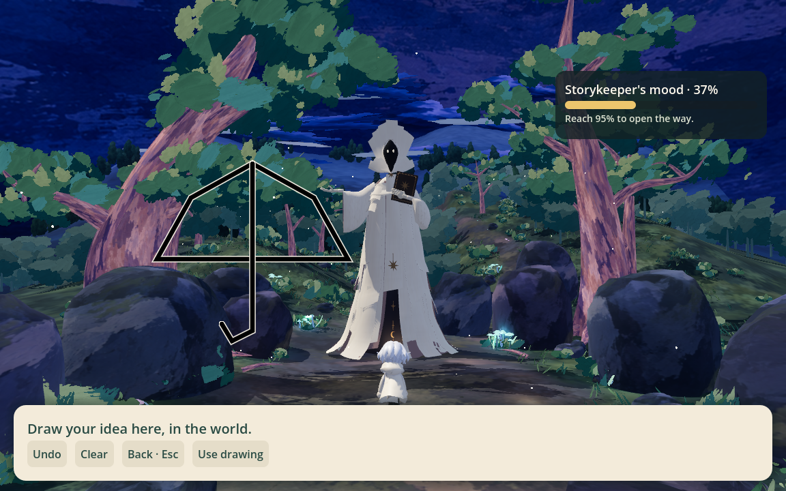
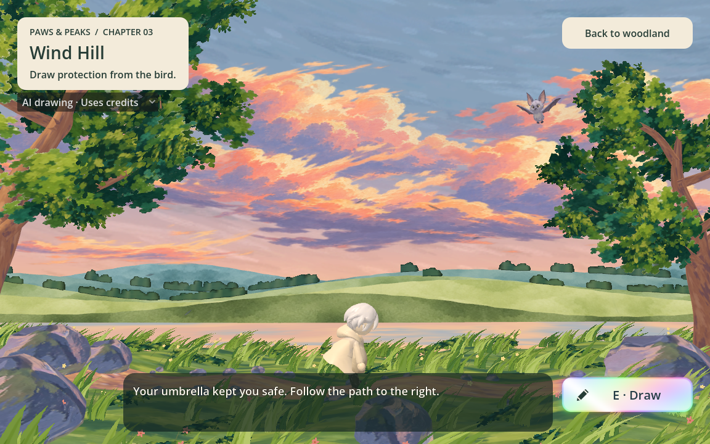
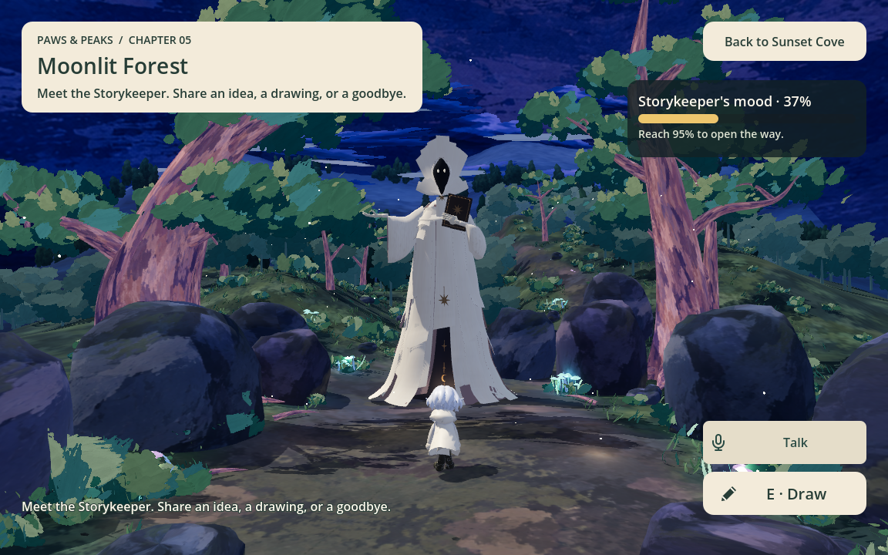

# The Storykeeper: narrator and final encounter

Implements the desktop MVP for #63 and narration voice for #66. Design source:
the user-provided `boss-narrator_agent_requirements_v0_1.md` in Downloads. This
English adaptation lives under `docs/`; the original source file remains in Downloads.
The draft describes a broader target, not a claim that all tooling is delivered.

## Player experience

Fixed chapter introductions and authored route hints do not call the language model.
Their first speech synthesis is cached across journeys; text, voice or settings
changes select a new cache entry. Actual player dialogue, drawings and contextual
reactions use the model. Waiting idly no longer triggers paid model calls.
Subtitles use a translucent dark panel at the bottom, without a Skip button; Stop
voice remains inside the dialogue panel. Duplicate bottom HUD guidance is hidden
while subtitles are shown.

In Chapters 1–4, the narrator responds to chapter arrivals, drawings and confirmed
encounter outcomes. Short subtitles and optional speech accompany these events.
Only Chapters 4 and 5 expose the bottom-right microphone **Talk** CTA beside **Draw**.
Chapter 4 talks to the otter; Chapter 5 talks to the Storykeeper. Chapters 1–3 keep
passive narration without player dialogue. Talk opens a paper dialogue panel. It pauses movement
while open; closing restores the scene. Guidance + reactions and Guidance only settings control
contextual reactions; Voice and Stop voice control spoken playback independently.

The narrator is warm, curious, verbose and fond of the world. Chapter 5 reveals the
same voice as the towering Storykeeper, who fears the final page. The player can
write freely or **Draw an idea** directly over the game scene, explain its meaning,
and correct misunderstandings. The drawing layer shares the earlier chapters'
transparent canvas, with a bottom toolbar and no separate paper sketch panel.
The referee evaluates intent and feasible effects without a fixed keyword/item list.
The boss mood starts at 37%, changes only with evaluated player dialogue/drawings,
and is clamped to 0–100. Below 20% is red, 20–80% yellow, above 80% green. The exit
opens at 95%; a referee proposal alone cannot bypass the threshold. Duplicate
requests do not award points twice, waiting gives no points, and an opened route
stays open even if mood later falls. This supersedes the original score-free design.
The performer supplies the character's response, while game code applies only the
permitted transition. Earlier encounter mechanics remain authoritative.

- **Leave:** persuade the Storykeeper to make way, then choose when to walk through
  the open exit. This leads through the final page turn to **A New Dawn**.
- **Stay:** explicitly choose staying as this journey's ending, then confirm the
  neutral prompt. A final page turn opens **A Place to Stay**, with the same journey
  recap, replay and memory-exploration controls.
- **Rest:** remain temporarily without ending anything. Silence, hypothetical
  questions and quoted/negated choices never count as stay confirmation.

Opening the exit is permanent within the run. Neither ending can overwrite the other.
A new journey clears narrator context and drafts as well as the existing chapter recap.

## Ownership

- `3d_game/scripts/narrator/narrator.gd`: shared journal transport, event sequencing,
  stale-response filtering and speech playback.
- `3d_game/scripts/narrator/story_panel.gd`: dialogue, drawing, subtitles and choice UI.
- `backend/narrator_agent/`: neutral referee, performer, persistent evidence, local
  authoring bench and semantic cases.
- `backend/speech/`: ElevenLabs with separate narrator and future otter voice IDs.
- `3d_game/scripts/boss/storykeeper.gd`: visual reactions only. The delivered idle
  animation remains in use; release slides the grounded body aside. Future authored
  reaction clips can replace the fallback without moving decision logic into the rig.

See [Backend guide](../backend/BACKEND.md#narrator-and-speech) for configuration,
protocol, local bench, privacy and evaluation. Music is outside this change.

## Coverage and limitations

The journal records chapter arrivals, drawing submissions/interpretations, confirmed
object uses and NPC/encounter results, plus actually displayed dialogue. It does not
record every movement frame or infer successful use from a submitted drawing. Memory
is evidence-backed, but model wording can still be mistaken; semantic evaluation is
needed in addition to deterministic state guards.

Implemented checkpoint/fork tools restore narrator state in the authoring bench,
not a full playable-world save. Web delivery and cloud saves remain future work.
The otter has its own conversation prompt and configured voice. It cannot change
the boss mood or final ending. Approach the otter to use Talk.
No new skeletal clips are claimed. The supplied idle and a game-controlled step
aside provide the current presentation.

## Verification

```sh
backend/.venv/bin/python -m unittest discover -s backend/tests -v
godot --headless --path 3d_game --script res://tests/narrator_smoke.gd
godot --path 3d_game --script res://tests/narrator_visual.gd
```

Paid end-to-end validation requires explicit opt-in:

```sh
godot --path 3d_game --script res://tests/narrator_live_smoke.gd -- --allow-live
```

The live check requires both providers and verifies an actual reply and audio
playback while a request to rest leaves the ending unset. Normal scripted tests
never implicitly enable narrator provider calls. Visual fixtures use authored text
for repeatable layout inspection, not a fabricated record of a real model reply.








## Microphone input

Talk supports both typing and recording. **Record** starts a visible, muted-monitor
microphone capture; **Stop recording** sends at most 20 seconds to ElevenLabs Scribe
v2. The transcript appears as an editable draft. Only **Send** starts the actual
conversation or mood evaluation. Closing the panel cancels recording; obsolete
transcripts cannot populate a reopened conversation. Permission/device errors and
recognition failures retain the typing path. Microphone hardware/OS permission
must still be checked on the player's own machine.

The local capture is mono PCM at 16 kHz. Recordings are not played through speakers,
and mailbox audio is removed after processing. Provider retention follows the
ElevenLabs account/API settings. See the backend guide for the separate STT model.


