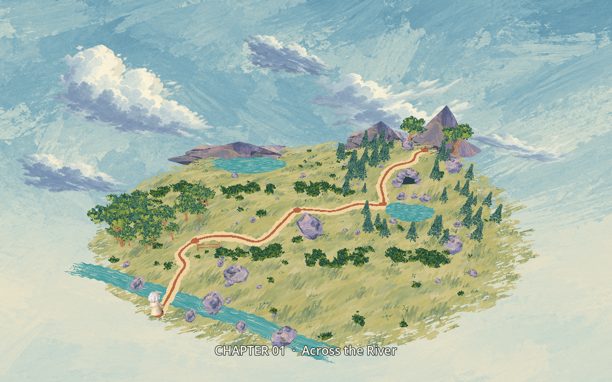
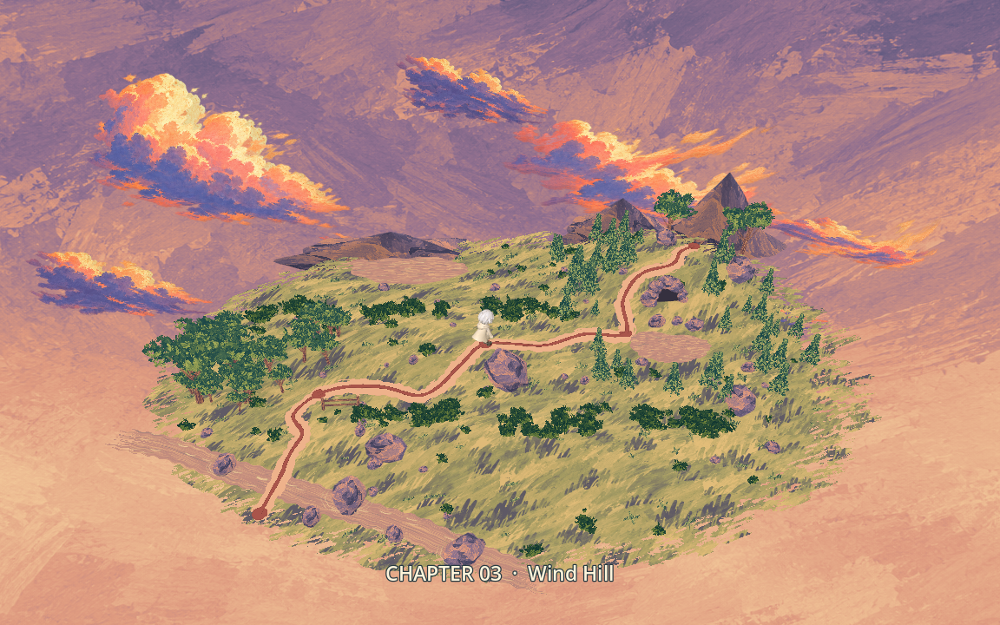
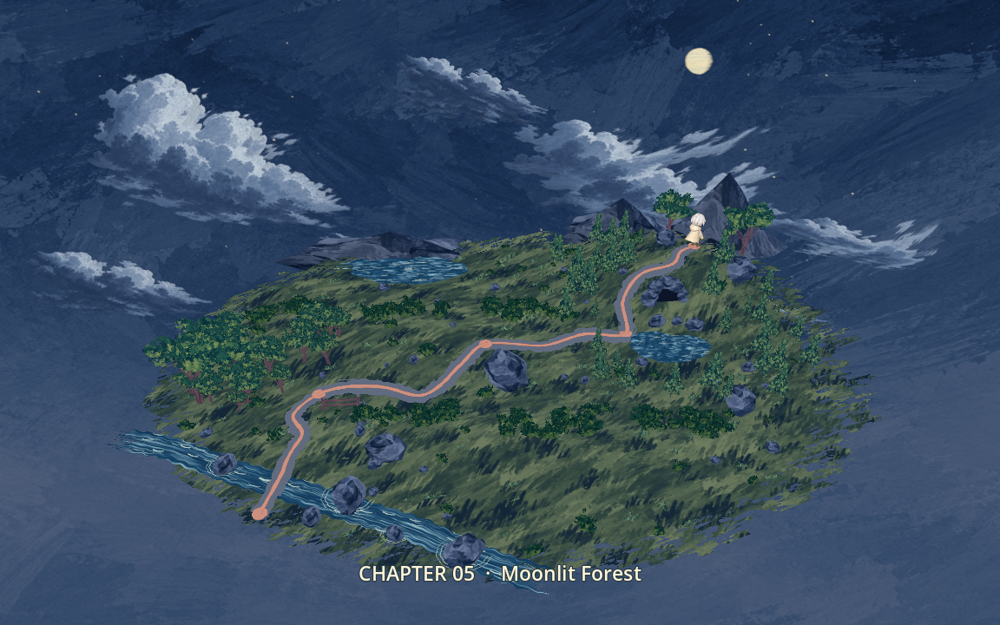
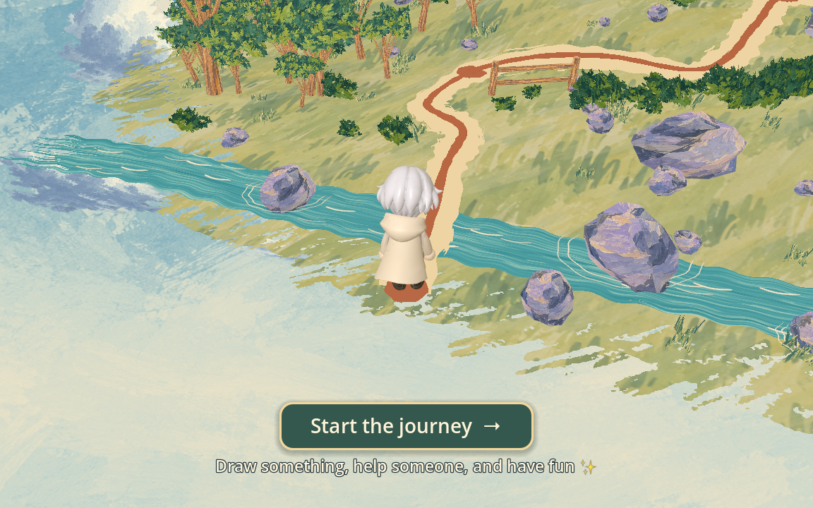
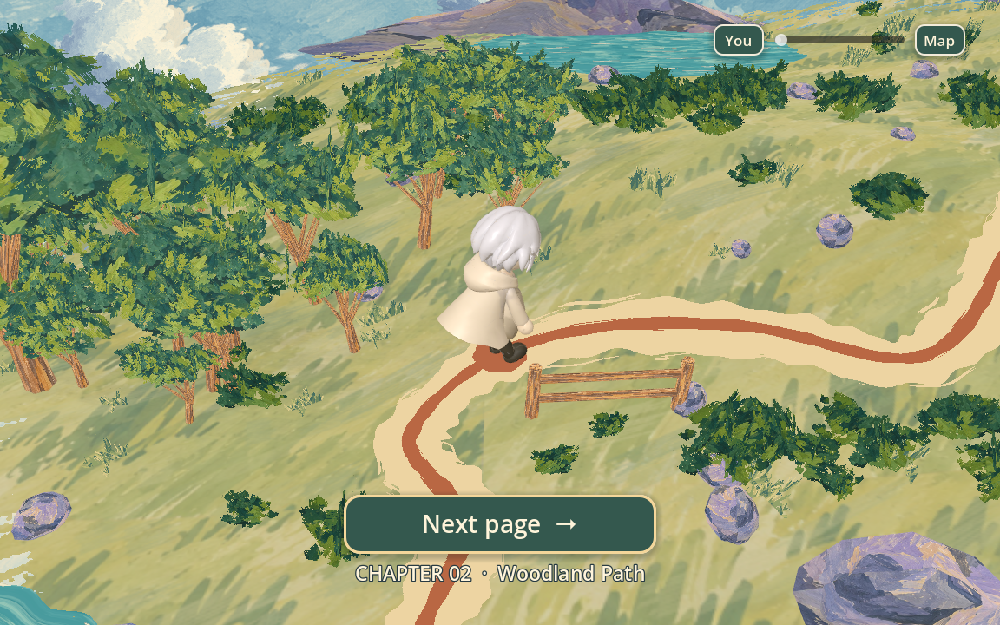
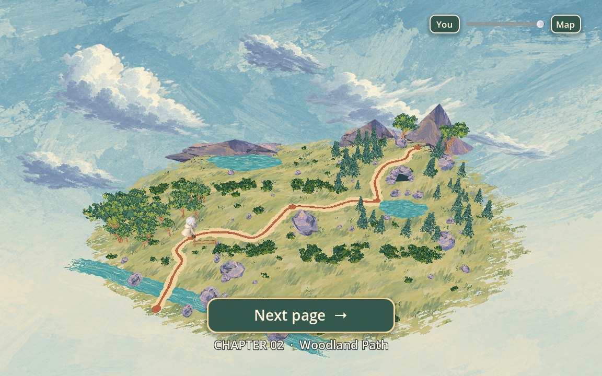
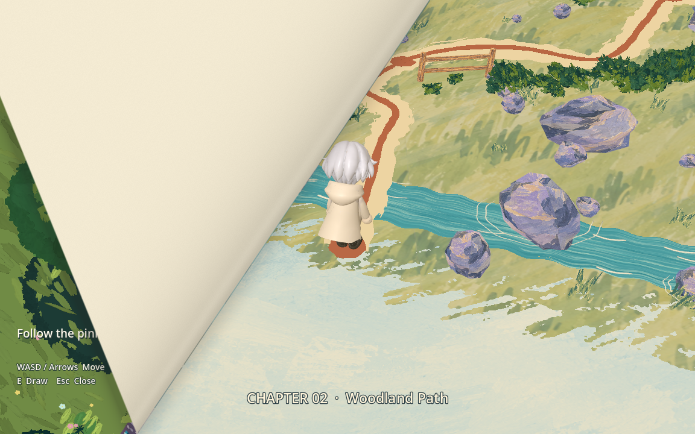

# Overworld chapter transitions (#53)

## Behavior

F5 opens the supplied storybook map in daylight, holds the full view and zooms
to the protagonist at Chapter 1. It stays there with one prominent **Start the journey**
button until the player clicks it or uses Enter/controller confirm. The page
then turns into Across the River; its existing spawn physics let the character
drop onto the path after the reveal. Repeated activation starts only once.
The supporting copy reads “Draw something, help someone, and have fun ✨”.

The existing forward exits in Chapters 1–4 return to the map. The page turn
reveals a close view of the chapter just completed. As the camera pulls back,
the Moonlit Wanderer walks along the painted route to the next chapter. After
arrival the camera zooms in and shows **Next page →**. The player decides when
to enter; it never advances just because time passes. While waiting, the scroll
wheel, trackpad magnify gesture, slider and **You / Map** buttons smoothly zoom
between the current chapter closeup and full-map view. The slider and buttons
retain keyboard/controller focus navigation. Zoom cannot exceed either bound.

This September 14 revision supersedes the temporary automatic-entry behavior.
Every page lifts from the bottom-right toward the upper-left. Scene-to-map,
map-to-scene and ending turns share one shader and one physical fold angle;
there is no mirrored return direction. The reflected page bounds create a
lifting corner with a shaded paper underside and a soft cast shadow.

| Journey | Map appearance |
| --- | --- |
| Opening → Chapter 1 | Day |
| Chapter 1 → Chapter 2 | Day |
| Chapter 2 → Chapter 3 | Smooth day-to-sunset transition during the walk |
| Chapter 3 → Chapter 4 | Sunset |
| Chapter 4 → Chapter 5 | Smooth sunset-to-night transition during the walk |

The Stage 5-to-dawn ending now uses a slower final page turn and soft sunrise
before the victory book (#60). Backward preview buttons keep their existing
navigation. **Begin a new journey** returns to the daylight map and Start CTA before a
fresh river.
Running an individual chapter with F6 remains supported: its next forward exit
infers the correct map location and time from the scene path.

The map uses the existing gameplay exits. River completion, the dog distraction
and the bird protection encounter still gate progression. Stage 4's cave exit
and the Stage 5 ending shortcut retain their documented preview status; this
map integration does not implement otter or final-boss mechanics.

## Assets and conversion

Source: the team's supplied `map-overworld-three-times` folder, provided for
issue #53 on September 13, 2026. It contains day/sunset/night GLBs, source HTML/
JavaScript and reference images. No ready-to-import page-turn clip was present;
`page_turn.gdshader` implements the book-page curl natively in Godot.

`3d_game/tools/import_overworld.py` uses only Python's standard library. To
rebuild from the original delivery:

```sh
python3 3d_game/tools/import_overworld.py /path/to/map-overworld-three-times
```

The converter validates the shared material slots, extracts/deduplicates the
original PNG pigments, and repacks the night GLB into one geometry asset that
also contains the moon and 90 stars. It retains 562 visible meshes and all three
authored clips, with 69 unique pigments and 36 palette materials. The original
optional current-location ring was excluded from the delivered exports; the
shared animated protagonist marks the location instead.

Route travel follows all 421 center-line samples from the original painted
ribbon, including its height above terrain and water. The five chapter points
and full-view camera come from the delivered metadata. Conversion strips source
editor extras that contained non-English stage labels; game captions and
repository text are English.

The palette shaders mix the three original RGB pigments on one geometry while
retaining one alpha silhouette. Daytime geometry is never drawn a second time
to fake a dissolve. Opaque, cutout and soft-cloud materials use separate depth
modes. Native imported UV orientation is retained. Three independent animation
players run the supplied 8-second wind, 8-second water and 24-second cloud clips
simultaneously; stars also twinkle. The hero uses existing idle/walk assets and
small dedicated lighting.

Original scene metadata and the Three.js MIT notice are retained in
`assets/overworld/`. Source generator techniques informed the native palette
mixing and route extraction. No Three.js runtime is shipped in the game. The
map art is team-supplied; the source notes describe AI-generated cloud and sky
textures. This integration creates no additional generated art or paid calls.

## Desktop previews









## Structure and recovery

- `Journey` autoload owns the guarded page/map/stage sequence and a temporary
  outgoing-frame texture. It does not own encounter completion or AI jobs.
- The overworld scene owns route travel, camera composition, time blending and
  chapter CTAs and bounded map browsing.
- `river_level.gd` and the shared `path_exit.gd` route forward exits through
  `Journey.travel_to()`. Ending restart calls `Journey.start_intro()`.
- The destination loads in the background while the map plays. The outgoing
  scene is frozen during the page turn; the new scene resumes after it. Scene
  removal leaves one active world. The screenshot and input blocker are released
  after each transition.
- A failed map open restores the previous stage. A failed destination load
  leaves the map visible with **Try again**. No failure submits an AI request.

The intro takes approximately three seconds to reach the Start CTA. Route walks take at least
3.4 seconds, with a 1.8-second pullback, a 3.2-second time change when applicable,
and a 1.65-second arrival zoom. Page curls last 0.95 seconds (1.65 seconds for the ending). Chapter CTAs have no
time limit. `duration_scale` is a test seam; production defaults to 1.0.

## Verification

Validation uses Godot 4.7.2 Standard. All generation checks use offline fixtures.

- `overworld_smoke.gd`: holds the opening closeup until Start, keyboard activation,
  duplicate activation guards, all four later journeys waiting for confirmation,
  zoom bounds and closeup/full-map composition,
  correct time changes, simultaneous art animations, scene cleanup, and a fresh
  Start screen after restarting from night.
- Existing river-to-woodland, woodland, Wind Hill and Sunset Cove exit checks
  cross their real gameplay boundaries, await map travel and explicitly confirm
  the chapter CTA.
- Ending checks include explicit Start confirmation after **Begin a new journey**.
- `overworld_visual.gd`: native Forward Plus renders of all three map times and
  the Start CTA at 1152×720 and 850×720.
- `overworld_transition_visual.gd`: real mouse activation of Start, both page-turn
  contexts with a consistent angle, the intermediate sunset blend, later chapter
  CTAs and full-map browsing. Append `-- --preview` to leave the second
  chapter’s map CTA open for a manual playtest.
- `page_corner_smoke.gd`: native rendered-pixel checks for map entry, map return
  and the ending; the bottom-right reveals first while the left and top-right
  remain on the outgoing page. This check requires a graphical renderer.

The original integration passed nine flow/encounter/exit suites. The current CTA revision rechecks all five chapter confirmations and zoom
bounds, ending restart, native map interactions and the rendered turn corner
for every transition context. The river/dog/bird mechanics are unchanged.
Desktop screenshots are retained in `assets/overworld/`.

Godot 4.7.2 reports one zero-reference `RefCounted` cleanup warning per threaded
resource request. A separate single-material probe reproduces it without the
map; synchronous loading does not. The headless dummy renderer also crashed
once during shutdown after passing the map assertions. The native full-flow run
completed with exit code 0; map instances, page textures and input blockers were
released. Sandboxed headless runs can additionally report a macOS certificate
access diagnostic. Web export and browser rendering remain unverified.

## Playtest follow-up

The River drawing button shows **E · Draw** for keyboard/mouse input. Active
controller input switches the drawing and control hints to that controller’s
layout; mouse/keyboard input or unplugging the controller restores keyboard
hints. Small stick drift does not switch layouts. `input_hints_smoke.gd` checks
these transitions and the Xbox, PlayStation and Switch label mappings.

The updated opening copy was checked at 1152×720 and 850×720. The desktop
generation smoke, River smoke and all 21 backend unit tests passed with offline
fixtures. A missing private configuration in the isolated preview checkout
caused the reported generation configuration error; reconnecting the existing
ignored configuration passed validation with provider requests blocked. This
does not establish live provider availability. See the
[checkout setup notes](DESKTOP_GENERATION.md#separate-checkouts-and-worktrees).
