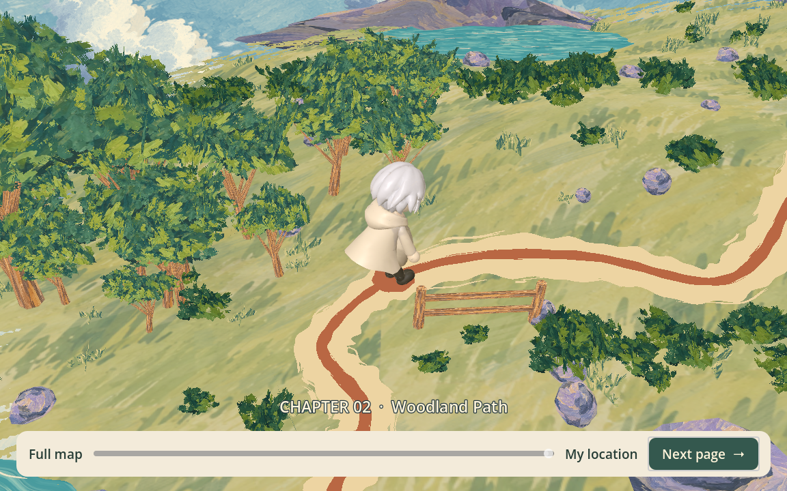

# Overworld chapter transitions (#53)

## Behavior

F5 opens the supplied storybook map in daylight, holds the full view, zooms to
Chapter 1 and turns the page into Across the River automatically.

The existing forward exits in Chapters 1–4 now return to the map. The first
page turn reveals a close view of the chapter just completed. As the camera
pulls back, the Moonlit Wanderer walks along the painted route to the next
chapter. After arrival the camera zooms in and waits for **Next page**.

During this wait, use the mouse wheel, trackpad pinch/scroll, slider, **Full map**,
or **My location** to inspect the map. Keyboard **−/+** and controller shoulder
buttons also zoom; Tab/D-pad navigation and the normal confirm action activate
the buttons. Zoom is bounded by the full map and the current chapter closeup.
The player cannot move to another chapter or skip an encounter from this view.
Click **Next page** to return the camera to the destination and turn into its
playable scene. Repeated clicks and repeated exit signals advance only once.

| Journey | Map appearance |
| --- | --- |
| Opening → Chapter 1 | Day |
| Chapter 1 → Chapter 2 | Day |
| Chapter 2 → Chapter 3 | Smooth day-to-sunset transition during the walk |
| Chapter 3 → Chapter 4 | Sunset |
| Chapter 4 → Chapter 5 | Smooth sunset-to-night transition during the walk |

The Stage 5-to-dawn ending and backward preview buttons keep their existing
navigation. **Play again** restarts the daylight map intro and a fresh river.
Running an individual chapter with F6 remains supported: its next forward exit
infers the correct map location and time from the scene path.

The map uses the existing gameplay exits. River completion, the dog distraction
and the bird protection encounter still gate progression. Stage 4's cave exit
and the Stage 5 ending shortcut retain their documented preview status; this
map integration does not implement otter or final-boss mechanics.

## Assets and conversion

Source: the team's supplied `map-overworld-three-times` folder, provided for
issue #53 on September 13, 2026. It contains day/sunset/night GLBs, source HTML/
JavaScript and reference images. No ready-to-import page-turn clip was present;
`page_turn.gdshader` implements the book-page curl natively in Godot.

`3d_game/tools/import_overworld.py` uses only Python's standard library. To
rebuild from the original delivery:

```sh
python3 3d_game/tools/import_overworld.py /path/to/map-overworld-three-times
```

The converter validates the shared material slots, extracts/deduplicates the
original PNG pigments, and repacks the night GLB into one geometry asset that
also contains the moon and 90 stars. It retains 562 visible meshes and all three
authored clips, with 69 unique pigments and 36 palette materials. The original
optional current-location ring was excluded from the delivered exports; the
shared animated protagonist marks the location instead.

Route travel follows all 421 center-line samples from the original painted
ribbon, including its height above terrain and water. The five chapter points
and full-view camera come from the delivered metadata. Conversion strips source
editor extras that contained non-English stage labels; game captions and
repository text are English.

The palette shaders mix the three original RGB pigments on one geometry while
retaining one alpha silhouette. Daytime geometry is never drawn a second time
to fake a dissolve. Opaque, cutout and soft-cloud materials use separate depth
modes. Native imported UV orientation is retained. Three independent animation
players run the supplied 8-second wind, 8-second water and 24-second cloud clips
simultaneously; stars also twinkle. The hero uses existing idle/walk assets and
small dedicated lighting.

Original scene metadata and the Three.js MIT notice are retained in
`assets/overworld/`. Source generator techniques informed the native palette
mixing and route extraction. No Three.js runtime is shipped in the game. The
map art is team-supplied; the source notes describe AI-generated cloud and sky
textures. This integration creates no additional generated art or paid calls.

## Desktop previews





## Structure and recovery

- `Journey` autoload owns the guarded page/map/stage sequence and a temporary
  outgoing-frame texture. It does not own encounter completion or AI jobs.
- The overworld scene owns route travel, camera composition, time blending and
  the bounded inspection controls.
- `river_level.gd` and the shared `path_exit.gd` route forward exits through
  `Journey.travel_to()`. Ending restart calls `Journey.start_intro()`.
- The destination loads in the background while the map plays. The outgoing
  scene is frozen during the page turn; the new scene resumes after it. Scene
  removal leaves one active world. The screenshot and input blocker are released
  after each transition.
- A failed map open restores the previous stage. A failed destination load
  leaves the map visible with **Try again**. No failure submits an AI request.

The authored intro lasts approximately four seconds. Route walks take at least
3.4 seconds, with a 1.8-second pullback, a 3.2-second time change when applicable,
and a 1.65-second arrival zoom. Page curls last 0.95 seconds. Inspection has no
time limit. `duration_scale` is a test seam; production defaults to 1.0.

## Verification

Validation uses Godot 4.7.2 Standard. All generation checks use offline fixtures.

- `overworld_smoke.gd`: automatic opening, all four map legs, correct palette
  boundaries, authored destination positions, simultaneous art animations,
  indefinite inspection, bounded zoom, duplicate request/click guards, scene
  cleanup, input release, persistent worker and restart after night.
- Existing river-to-woodland, woodland, Wind Hill and Sunset Cove exit checks
  cross their real gameplay boundaries and explicitly confirm **Next page**.
- Ending checks include the map intro when pressing **Play again**.
- River, dog and bird encounter regressions verify that map integration retains
  their existing challenge behavior.
- `overworld_visual.gd`: native Forward Plus renders of all three map times,
  close/full inspection, and 1152×720 / 850×720 windows.
- `overworld_transition_visual.gd`: both page-turn directions, the intermediate
  sunset blend and real mouse input on **Next page**.

All nine listed flow/encounter/exit suites passed. The complete overworld suite
also passed with the native Forward Plus renderer, including mouse-wheel zoom
and keyboard confirmation. The transition visual run passed real mouse clicks.
Desktop screenshots are retained in `assets/overworld/`.

Godot 4.7.2 reports one zero-reference `RefCounted` cleanup warning per threaded
resource request. A separate single-material probe reproduces it without the
map; synchronous loading does not. The headless dummy renderer also crashed
once during shutdown after passing the map assertions. The native full-flow run
completed with exit code 0; map instances, page textures and input blockers were
released. Sandboxed headless runs can additionally report a macOS certificate
access diagnostic. Web export and browser rendering remain unverified.
