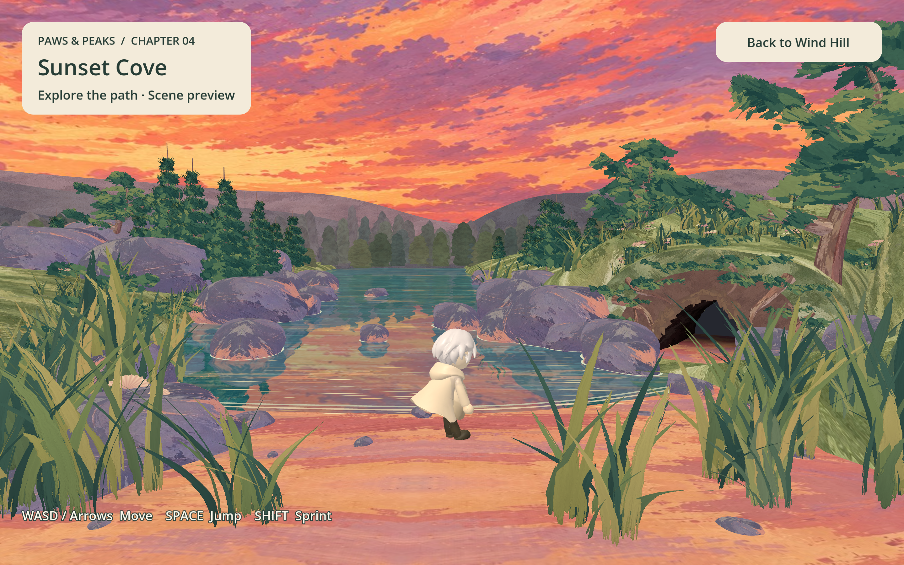

# Stage 04: Sunset Cove integration

Updated: 2026-09-14. Implements the environment and transition requested in
issue #31. Stage 4 also includes the otter greeting described below; nearby sketch submission is enabled. AI-selected animation reactions are implemented;
progression rules remain separate work.
The Stage 5 environment and cave exit are added by #32.

## Route and controls

- In Stage 3, move right toward the large rock beside the right-hand tree.
  Reaching world **x >= 9.5** enters Sunset Cove automatically. The boundary sits
  just before the rock's solid edge so the player can walk through without jumping
  onto the rock. It covers every Z position and height, including nearby grass
  and airborne movement. Stopping before the boundary keeps Stage 3 active.
- Stage 3's main progression is horizontal; forward/back movement remains available.
  The shared exit marker supports world -Z for Stage 2 and world +X for Stage 3.
- Direct entry: `3d_game/scenes/sunset_cove/sunset_cove.tscn`.
- Stage 4 uses the shared Moonlit Wanderer at visual scale 1.08 (25% smaller than
  the previous 1.44 appearance), with walking,
  sprinting, jumping and the existing keyboard/controller controls.
- Spawn is on the near beach at (0, 2, 6), with a short drop onto the sand.
  The delivered 53-degree camera keeps its orientation and pulls back three units
  to frame the character. It follows ground movement without mouse orbit.
- **Back to Wind Hill** returns to a fresh Stage 3 preview. Scene changes preserve
  the existing GenerationWorker autoload; AI requests are made only when the player submits a drawing.
- Continue right to the cave approach at world x>=5.5 to enter Moonlit Forest.
  The boundary covers all Z positions and heights, including the surrounding
  grass; no jump or narrow tunnel entry is required. See
  [Stage 05 integration](STAGE05_INTEGRATION.md).
- Sand, river banks, cave surfaces, solid rocks and main trunks have collision.
  Water, distant scenery, painted foliage and the background ground underlay do not.
  Falling below y=-4 returns to the beach. Water is not a walkable floor.



## Project-owned assets

The source is the user's `Downloads/stage4-sunset-cove-unified/sunset-cove.glb`
(revision 11). It is copied unchanged to `3d_game/models/stage04/sunset_cove.glb`.
SHA-256: `e4d8655bf1d37b6448b67f09b5a5883fa80f40bc174b8ac8bb8728fe8996cd9f`.

The GLB contains 1,305 meshes, approximately 1.20 million triangles, ten embedded
PNG textures, the reference camera, and a 16-second animation with 945 source
channels. Godot removes three immutable tracks during import. All ten extracted
project textures were checked against their embedded bytes. There are no external
URI dependencies or runtime references to Downloads. Keep the GLB, extracted PNGs,
import metadata and scripts together. The original delivery remains untouched.

The delivery describes generated surface textures and a user-supplied transparent
brush atlas. Source authorship and asset usage terms were not supplied. Three.js
vendor code is not included in the game; the original delivery retains its license
and source files.

## Materials and motion

- The GLB already stores the correct texture V orientation; no image replacement
  or vertical texture flip is applied.
- The import script preserves vertex colors and unlit painted materials. Godot's
  standard material cannot reproduce the source's mirrored-repeat sampling, so
  seven painted material families use a small native shader that folds positive
  and negative UVs. This fixes stretched stripe artifacts on the sky, sand and rocks.
- The sky mirrors horizontally and clamps vertically. Its shader renders both
  sides of the sphere and drifts the painted clouds gently.
- Water blends two continuously advancing samples of the delivered painted texture
  at 0.48 and 0.69 world units per second. This is a native Godot approximation.
- A live planar reflection mirrors the gameplay camera across the water at
  y=-0.07. A SubViewport shares the existing World3D, including the protagonist,
  animated foliage and painted sky. Water and its overlays, plus the background
  ground underlay, use visual layer 20 and are excluded from the reflection camera
  to prevent feedback and underlay occlusion. The gameplay camera still sees them.
  The water mixes the reflection with its painted color at 29–51% depending on
  viewing angle, with small moving UV ripples adapted from the source renderer.
- Reflection updates run after camera follow. The render target preserves the
  gameplay aspect ratio on resize and is capped at 1280 by 720 pixels. A local
  camera-axis flip keeps a valid camera basis; the shader reverses the image flip.
  The scene owns its water material and viewport, which are freed on exit. This
  adds a second scenery render pass; it does not duplicate geometry or physics.
  See Godot's [viewport documentation](https://docs.godotengine.org/en/stable/tutorials/rendering/viewports.html)
  for shared worlds and camera cull masks.
- The imported `Handpainted_Breeze_And_Water` clip plays on a 16-second loop,
  retaining the source's 12 fps node animation. Godot consumes the `_Loop` suffix
  as an import hint. Leaves, grass, tree branches and exported water details animate.
- The browser-only dynamic painted shadows, extra surface glazes and expanding
  contact-ripple shader are not ported. Contact waterlines
  retain their exported appearance. The Godot preview does not claim exact visual
  parity with the original HTML renderer.

## Verification

Godot 4.7.2 Forward+ on Apple M1 rendered the final scene without gameplay or shader
errors. `sunset_cove_smoke.gd` checks actual horizontal walking from Stage 3 into
Stage 4 without jumping, grounded beach spawn, camera and character framing,
animation transform changes, material/texture preservation, selected collisions,
walking/jumping/landing, fall recovery, return navigation and persistent autoload.

`wind_hill_exit_smoke.gd` samples near/far Z positions and airborne height on both
sides of the +X boundary. The existing `woodland_exit_smoke.gd`,
`stage_transition_smoke.gd`, `woodland_smoke.gd` and `wind_hill_smoke.gd` cover the
earlier scenes and unchanged -Z boundary. Scene-count assertions now count 3D
worlds while allowing the GenerationWorker added by PR #30 to persist.

`water_reflection_smoke.gd` checks shared-world rendering, water/underlay exclusion,
camera projection after movement, resize aspect ratio and resolution cap, viewport
cleanup and scene re-entry. Its rendered mode uses a live magenta probe over open
water, checks the reflection camera's projected pixel, and verifies that enabling
reflection changes the corresponding water pixel. It also captures the gameplay
view and resized view for visual inspection.

Run from the repository root:

```sh
godot --headless --path 3d_game --script res://tests/sunset_cove_smoke.gd
godot --headless --path 3d_game --script res://tests/wind_hill_exit_smoke.gd
godot --path 3d_game --script res://tests/water_reflection_smoke.gd -- --visual
```

Add `-- --visual` to the first command, and omit `--headless`, to capture Stage 3's
rock approach and Stage 4's gameplay view in `/private/tmp/`.

The headless sandbox emits macOS certificate and log/editor-settings permission
messages. These are separate from gameplay assertions. Web export, browser
performance and final collision optimization have not been verified. The 64 MiB
GLB and roughly 1.20 million triangles require a separate Web budget pass.

## Otter greeting

One textured otter stands on solid sand at world X=2, Z=4, just in front of the water.
It turns toward the player and repeats `Big_Wave_Hello` whenever the player is
more than 5 horizontal world units away. Approaching within that distance
blends to `Idle_11`; stepping away resumes waving. Confused waiting and selected
reactions take priority over this distance behavior. While waiting, it faces the
sketch placement center instead of tracking the player; afterward, player-facing resumes. After a reaction, the otter
resumes waving or idle according to the player's distance.

`3d_game/models/otter/otter.scn` contains one model, skeleton and texture set.
`animations.res` contains all 13 full clips; `animations.json` contains the short
selection descriptions for eight AI-selectable reactions. Walking, idle, swim-idle,
confused scratch and the greeting wave are excluded from AI selection; their clips
remain available for normal scripted behavior. The same skeleton plays every clip through one
AnimationPlayer. Idle, walking and swim-idle loop; other clips are one-shots.
The 0.03-second companion clips are omitted.

The user supplied the 13 Meshy imports. Their skeleton hierarchy, bone names and
rest transforms matched during extraction. Original imports are preserved only
in ignored local `backend/output/otter-source-imports/`; the runtime resources
have no dependency on them. The asset package is approximately 13 MB, replacing
241 MB of duplicated model and extracted texture files.

To rebuild from the local originals:

```sh
Godot --headless --path 3d_game --script res://tools/extract_otter_animations.gd -- /absolute/path/to/otter-source-imports
```

The focused `otter_greeting_smoke.gd` checks grounded placement, facing,
proximity transitions and repeated waving. Use `-- --visual` to capture the wave and idle in Stage 4.

## Drawing and animation options

Within 2.5 world units of the otter, while grounded, press **E** or **Draw** to
open the sketch overlay. Submission saves the original PNG and uses the shared
desktop generation flow with `encounter_id: "E04"` and `game_stage: "otter"`.
Each request includes `animation_options`, a map of animation keys to the short
English descriptions in `3d_game/models/otter/animations.json`. The desktop
mailbox retains this map alongside the request identity. Other stages omit it.

The first AI call guesses the object as usual, then chooses one suitable otter
reaction using the supplied descriptions. Stage 4 does not classify the object:
the response is `{ "item": { "name", "description", "movable", "texture_key", "color" },
"reaction": "Shrug" }` (field names shown schematically). `reaction` is an exact
animation key, validated by both backend and game. Selection adds no AI call.

The otter turns toward the submitted sketch/object placement center and repeats
`Confused_Scratch` while waiting for the model to render,
including after the interpretation arrives. Once the object appears,
`Otter.play_option(reaction)` plays the selected clip and returns to idle after
10 seconds, repeating shorter clips until that limit. A failed or canceled request stops the confused animation and
returns to idle. Invalid animation keys fail the request instead of guessing a
local reaction. Stale responses cannot interrupt a newer request.

The interpretation card and reference overlay use the shared preview. The model
appears at the sketch's ground position; a successful reveal clears the sketch
and reference. **Draw again** opens a fresh canvas after each success, with no
limit on repeats. Each submission has its own request ID and reaction; the previous
object remains until the next model successfully loads and replaces it.
Drawing is disabled while a request is pending; Stop waiting or
Escape cancels, preserving the draft. Failures allow another submission. Live
submission uses credits; Stage 4 has no offline model fixture yet.

The existing otter smoke test also checks proximity gating, E04 request labels, animation options in the desktop mailbox, and retained
drafts after cancellation, confused looping, and the transition from a rendered
model to the selected reaction. Provider outputs are simulated, with no paid calls.


## Otter offering and heart feedback

The otter starts sad, but its broken heart is hidden while it waves. Opening
narration and guidance only introduce the otter. On the first nearby idle, reveal
the gently splitting 2D broken heart beside its head and queue the unhappy-otter
guidance. The broken heart hides again whenever it waves; a whole happy heart
remains visible. The broken heart also hides while the drawing canvas is open or generation is
pending. It returns after cancellation, failure or an unhappy completed offering,
subject to the greeting visibility rules.
The camera-projected indicator follows the otter while it waves, waits and reacts.
The chapter objective asks the player to draw an offering to cheer it up.

The existing interpretation call now also returns `otter_happy` (boolean) and
`otter_response` (a short English reply explaining the decision). The model judges
the identified offering; submitting any drawing does not automatically succeed.
After the current request's model is successfully placed, the reply appears in
status text and an affirmative decision changes the indicator to a pulsing whole
heart. Once cheered up, the heart stays whole for this scene visit. Failed,
canceled, stale or incomplete results cannot change it. The eight reaction choices,
ten-second reaction loop and sketch-facing waiting behavior remain active.
This feedback does not add an exit lock or make a separate paid evaluation call.


## Microphone gift and speaking unlock

Speaking starts locked for every new journey, including direct Stage 5 previews.
After the first successfully placed offering cheers up the otter, narration first
announces the happy outcome and a surprise gift. When that line finishes, the
microphone rises beside its paws beneath the shared generation mist and blur.
After at least 1.2 seconds of conjuring, wait for the usage narration to start,
then reveal the clear microphone for a full three seconds. During that hold the
narrator explains the microphone and invites the player to speak in one combined line. The gift then disappears as Talk
becomes available. Narration failures use paced subtitles so the sequence can finish.
The player must still be near the otter to talk. Microphone capture never starts
automatically; the player clicks Talk. Narrator playback and drawing remain usable
while speaking is locked.

The unlock persists across chapter changes for this journey and resets on a new
journey. Additional offerings do not repeat the gift. Leaving the scene before
the gift completes does not grant the unlock. The gift is a local animation,
with no additional model generation or provider request.

The gift explanation and speaking invitation are one narration line beginning
when the microphone becomes clear: “The otter gave you a microphone. looks like
the otter want to talk to you! use the mic to speak”. Gift removal after three
seconds unlocks Talk without restarting this line; narration can continue afterward.

The first presented otter dialogue reply answers the player and naturally invites
them to continue the journey to the right. The backend supplies
this route and a first-reply flag to the otter prompt. Later replies do not repeat
the invitation unless asked about the route; unpresented replies do not consume it.


### Microphone lifetime

Every new game process starts without the microphone, including direct stage
launches. Earning it from the otter unlocks speaking across subsequent chapters
in that run. Beginning a new journey also clears the unlock. Prior saved unlock
files are no longer read or written.

### Saved Stage 4 request mode

The otter's default **Saved otter request · No AI** mode replays the newest complete
local Stage 4 live request from `backend/output/game_bridge/`. It reuses that request's
model, reference image, reaction and happiness response without provider calls or
preview rendering. Every submitted sketch receives that saved result. Missing
local data produces an error; it never switches to Live AI automatically. Select
**Live AI · Uses credits** to generate a new offering. Saved artifacts remain ignored.
