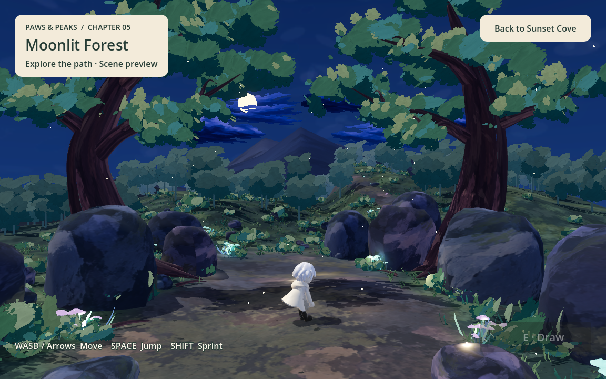
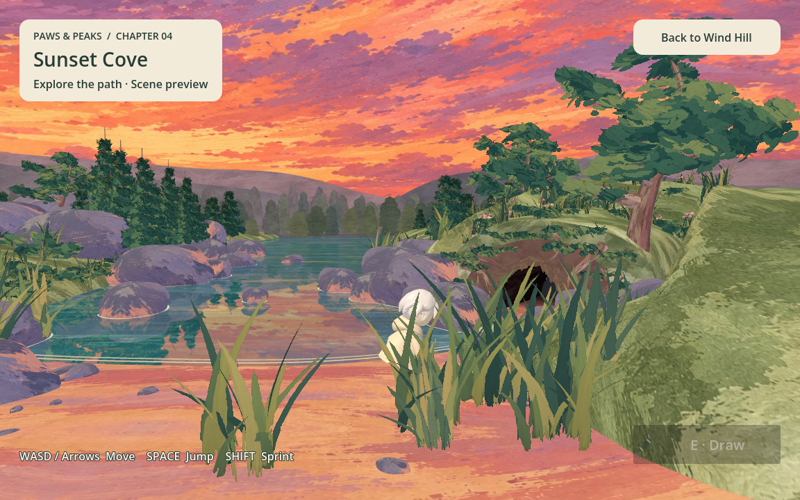

# Stage 05: Moonlit Forest integration

Updated: 2026-09-13. Implements the scene integration requested in issue #32.
The final boss encounter (#36), drawing rules and ending remain separate work.

## Entry and traversal

- In Sunset Cove, walk right toward the cave entrance shown in the supplied
  screenshot. Reaching world **x >= 5.5** enters Moonlit Forest. This boundary
  covers every Z position and height, so walking beside the cave or jumping also
  triggers the transition. The player does not need to climb onto a rock or enter
  the narrow tunnel. The existing Stage 2 and Stage 3 exit boundaries are unchanged.
- Direct entry: `3d_game/scenes/moonlit_forest/moonlit_forest.tscn`.
- The shared Moonlit Wanderer retains Stage 4's visual scale of 1.08. Walking,
  sprinting, jumping and controller movement use the existing player controller.
- Spawn is (0, 2, 4), with a short drop onto the central forest clearing. The
  delivered 52-degree camera keeps its angle and pulls back three world units
  for gameplay framing; it follows the player's ground movement.
- Terrain, rounded rocks, embedded trail stones, main trunks and buttress roots
  have mesh collision. Clouds, grass, leaves, mushrooms, fireflies and distant
  scenery are decorative. Falling below y=-4 returns to the clearing.
- **Back to Sunset Cove** returns to Stage 4's beach spawn, safely before its
  exit boundary. The GenerationWorker autoload persists across scene changes;
  entering a preview does not submit an AI request. The drawing button remains
  disabled until a Stage 5 encounter is implemented.





## Assets and provenance

The source is the user's `Downloads/scene5_moonlit-forest-v4/` delivery. The file
`moonlit-forest-painted.glb` is copied unchanged to
`3d_game/models/stage05/moonlit_forest.glb`.

SHA-256: `528833730f325ae88dd9988de34bc8b53081ef3f8e6df17b3e625801ba86b4ed`.

The 56,426,492-byte GLB contains 339 meshes, 607,629 triangles, seven embedded PNGs,
a reference camera, 20 lights and a 12-second animation with 204 source channels.
All seven Godot-extracted PNG files match the embedded image bytes. The game has
no runtime dependency on Downloads, Blender, the supplied HTML or Three.js.

According to the delivery notes, the foliage uses a user-supplied brush atlas;
other painted textures were generated for earlier revisions. The source retains
its editable Blender file, build scripts and Three.js MIT notice. Vendor code
and Chinese browser interface text are not included in the game. No additional
asset license grant was supplied with the delivery.

## Materials, lighting and motion

- The shared GLB import script retains vertex colors, original textures,
  alpha-cutout foliage, emission and camera/light data.
- A native foliage shader reads the authored material `windStrength` metadata
  and reproduces its UV-rooted vertex sway. The atlas scale/offset, color,
  emission and alpha thresholds remain intact. Shader deformation affects
  foliage rendering and shadows; scenery collision stays static.
- The imported animation moves the canopies, six cloud layers and 62 fireflies,
  including nine moving lights. Its source paths are not seamless at 12 seconds,
  so playback reverses at each end instead of teleporting back to frame zero.
  This produces a 24-second forward/back cycle rather than the browser's
  continuously advancing cloud paths.
- Native ambient light, distance fog, moon shadows and gentle bloom establish
  the night setting. The sky, moon and clouds opt out of fog as in the source.
  Directional lights use 50% and local lights 30% of the imported energy to
  compensate for the renderer's lighting response. Firefly bodies emit light
  into bloom; their actual moving point lights remain attached to the same nodes.
- Browser sprite halos and time-varying light pulses are not reproduced exactly.
  This integration preserves the delivered scene's composition and painted
  assets, without claiming pixel parity with Blender or the HTML renderer.

## Verification

Godot 4.7.2 Forward+ on Apple M1 rendered the scene for visual inspection.
`moonlit_forest_smoke.gd` walks from Stage 4 into Stage 5 without jumping, checks
spawn and collision, the delivered mesh/firefly counts, camera, animated clouds
and flight paths, repeat continuity, foliage atlas/wind settings, movement,
jump/landing, fall recovery, return navigation and persistent worker retention.
`sunset_cove_exit_smoke.gd` checks both sides of the new boundary at multiple
depths and an airborne height. Stage 4 traversal and reflection lifecycle tests
cover regressions in the preceding scene.

```sh
godot --headless --path 3d_game --script res://tests/moonlit_forest_smoke.gd
godot --headless --path 3d_game --script res://tests/sunset_cove_exit_smoke.gd
godot --headless --path 3d_game --script res://tests/sunset_cove_smoke.gd
godot --headless --path 3d_game --script res://tests/water_reflection_smoke.gd
```

For screenshots, omit `--headless` and add `-- --visual` to the first command.
It writes `/private/tmp/paws-stage04-cave-exit.png` and
`/private/tmp/paws-stage05.png`. Headless execution does not validate rendered
pixels. Web export, browser performance and the final boss have not been tested
or implemented by this scene integration; the large asset still needs a Web
delivery budget pass.
