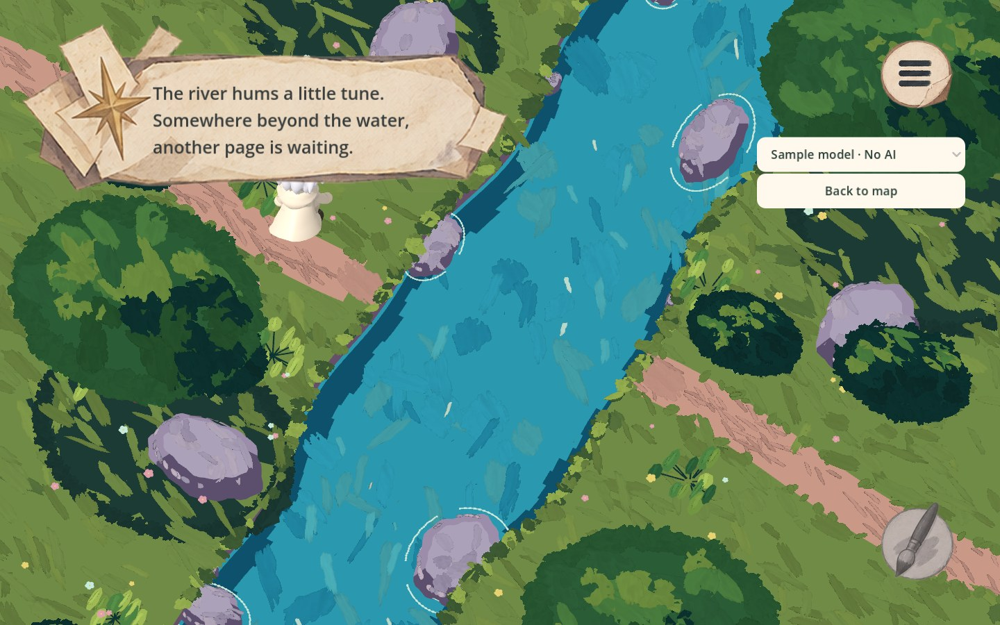
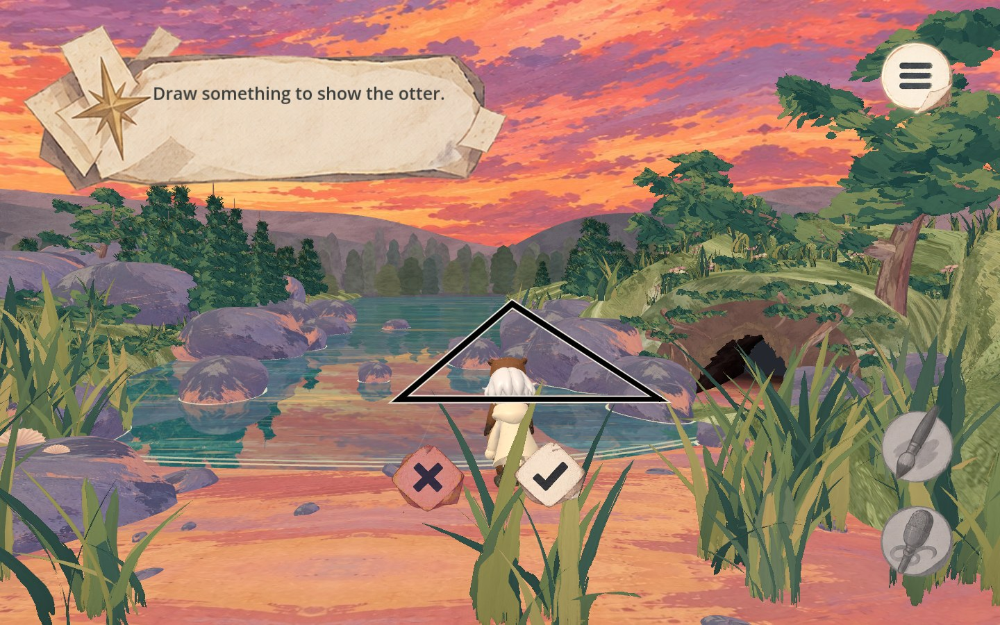
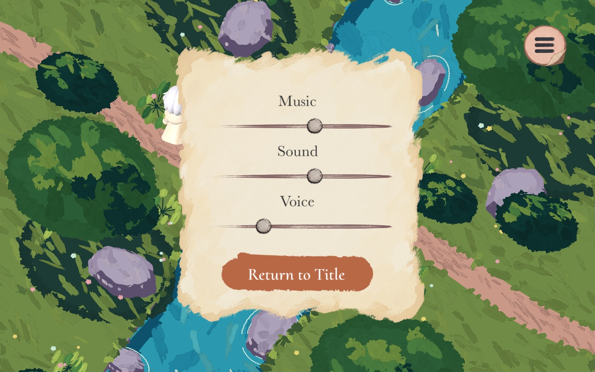
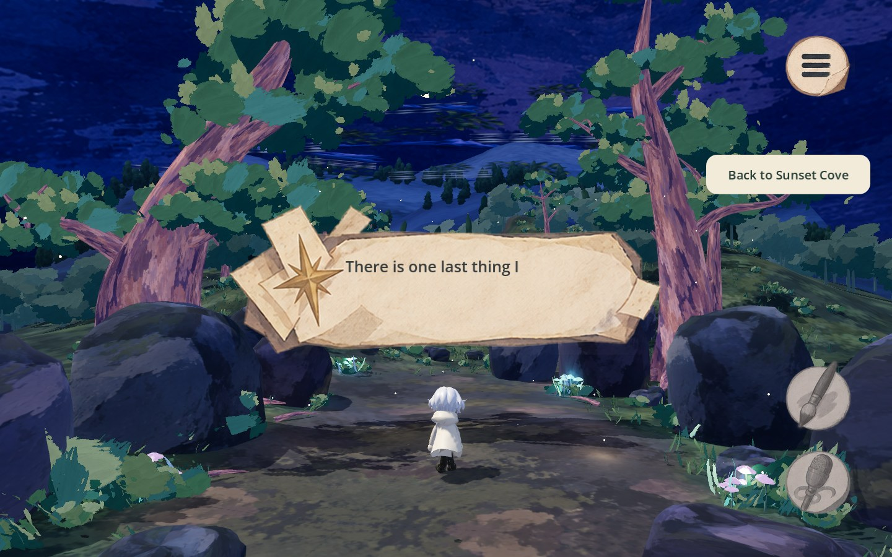
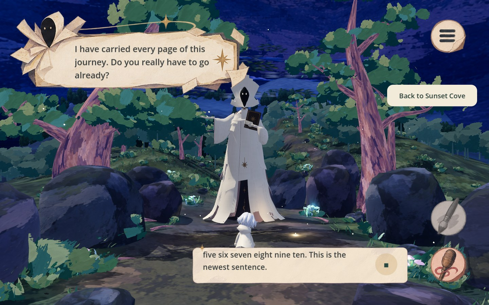

# Storybook UI update (#72)

The September 14 UI references replace the previous chapter cards, rectangular
Draw/Talk controls and permanent instruction labels. This is the UI portion of
#72; it does not complete its other gameplay and animation tasks.

## Presentation and controls

- Supplied normal, hover/focus, pressed and disabled art for pen, microphone and
  menu. The available drawing prompt keeps its circular pearl/iridescent cue.
- Narrator, Storykeeper and otter paper frames share the top-left subtitle area.
  Speech reveals a few words at a time. Labels wrap at the actual width and keep
  the newest two or three lines that fit; earlier lines scroll out of view.
- Player recognition uses a separate paper at the bottom right. One click starts
  recording; the stop control ends the recording. Existing silence detection and
  automatic final-transcript submission are retained. Drawing is disabled during
  the conversation. These changes do not add a typed chat or a transcript history.
- The menu is centered, with Music, Sound and Voice sliders and the three supplied
  Return to Title button states. The content stack is vertically centered, with
  extra top/bottom paper padding; the panel grows equally around its center when
  font metrics or the unmute control increase its minimum size. Opening it hides all chapter canvas layers and
  the narrator/player UI, leaving the menu and its top-right toggle visible.
  Closing it restores prior visibility and input modes, including active drawing.
  Narration pauses while the menu is open. An in-progress microphone recording is
  canceled when opening the menu. A previously muted session also shows an unmute
  control. Zero on an individual slider mutes that channel.
- Existing model/test selectors and Back navigation remain below the menu button
  during exploration. They hide with the rest of the HUD when the menu opens.
- Drawing remains transparent over the world. Cancel and Confirm replace the wide
  toolbar. Cancel preserves the draft; empty ink disables Confirm. Undo is Ctrl/Cmd+Z
  and Clear is Delete. Offline outcome selectors remain available during mock
  drawing. UI hit regions reject strokes, including drags across a menu or caption.
  Drawing errors appear in the speaker paper. Boss drawing now locks the player
  and camera while keeping the environment running.
- Chapter 5 hides the Storykeeper until the reveal. When live narration is ready,
  the paper moves to the center while words continue appearing, then a brief
  character scale pop and local impact cue reveal the boss. The frame returns to
  the top left with Storykeeper art. An eight-second fallback avoids waiting
  indefinitely for a voice service. The fallback line is locally paced text;
  it does not synthesize new speech. Scene changes cancel the presentation.
- Existing boss mood state and winning threshold remain authoritative; their old
  permanent debug card is hidden as requested.

## Otter integration boundary

`Journey.grant_microphone()` is the idempotent, session-local reward hook. Call it
when the teammate's Chapter 4 gift beat actually hands over the microphone. The
flag survives chapter changes and resets on a new journey. Arrival in Chapter 4,
opening a drawing, and showing an arbitrary generated object do **not** grant it.
No otter quest or gift animation is simulated by this patch.

To display an otter line, use the existing narrator panel contract with
`present({"speaker": "otter", "text": "..."})`. Voice production and the real gift
beat remain the teammate's work. The offline UI test calls `grant_microphone()`
explicitly to exercise the post-gift state, without claiming the quest is complete.

## Asset provenance

User-supplied `Downloads/UI Assets` and `Downloads/UI Assets 2`, provided on
September 14, 2026. In-game copies are under `3d_game/ui/storybook/` with English
filenames. No external image generation was used. SVGs containing embedded bitmap
sheets were flattened at their authored crop; vector-only menu tracks and return
buttons remain SVG. The baked play triangle in the narrator paper was removed
using adjacent paper to match the supplied blank-frame reference. Original
Downloads files were not changed. Menu labels use available system serif fonts
(Baskerville, Georgia, Times New Roman) with Godot fallback; exact font appearance
can vary by platform. Source artwork attribution follows the team's supplied
assets; no third-party license or authorship is inferred.

## Verification

Godot 4.7.2, desktop Forward+ on Apple M1, using offline scripted fixtures only:

- `storybook_ui_smoke.gd`: real menu pointer input, menu-only visibility and restore,
  all three audio controls, gift gating, pen/mic order, otter drawing, input hit
  exclusions, PNG output, centered boss reveal, recording and newest-line overflow,
  1440×900 / 1152×720 layouts, and scene cleanup.
- `narrator_smoke.gd`, `voice_conversation_smoke.gd`, `input_hints_smoke.gd`,
  `game_audio_smoke.gd`, and `otter_repeat_submit_smoke.gd`: passing after updating
  assertions that intentionally referred to the replaced UI.
- `stage_transition_smoke.gd`: starts at the opening map, submits an offline bridge
  drawing, opens/closes the menu during drawing, walks across the bridge and the
  authored exit, checks the Chapter 2 map label/position/Next page button, then
  enters Woodland Path. `map_return_smoke.gd` also passes. The reported return to
  the opening Start screen after Chapter 1 has not reproduced in these paths;
  the exact player action remains to be confirmed. No progression fix is claimed.
- Visual captures are under `docs/3d_game/assets/storybook-ui/`.

The older `dog_encounter_smoke.gd` still fails expectations for manual offering,
UNKNOWN feedback and model presentation. Equivalent failures reproduce on main
`70eb0df` with its original scripts and fixtures; it is not a passing regression
check. The current `automatic_offering_smoke.gd` passes.
Sandboxed headless runs also report the macOS certificate-store diagnostic and
cannot save user-directory draft fixtures; the desktop visual run is free of
script/runtime errors. Paid AI, live microphone transcription, and browser export
were not exercised in this UI pass.

## Captured layouts

