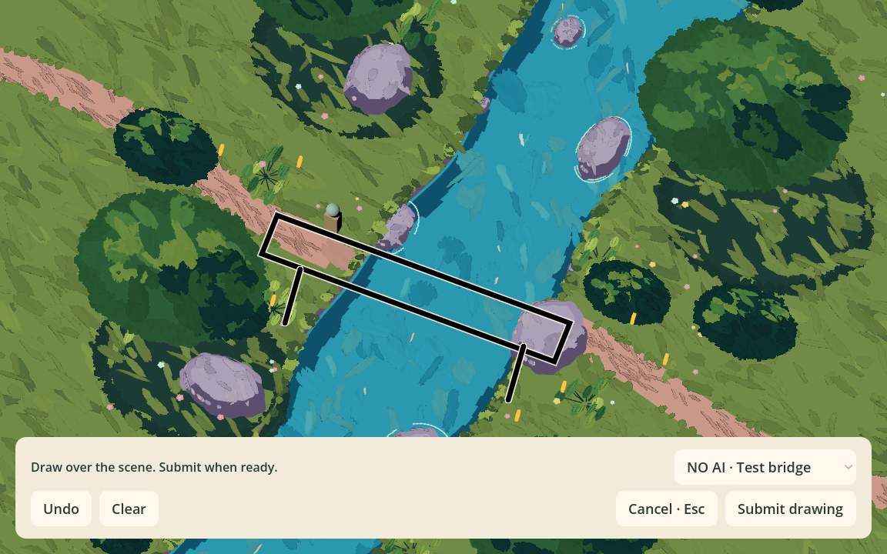
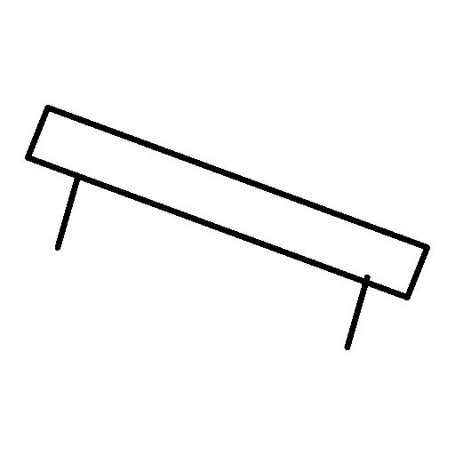
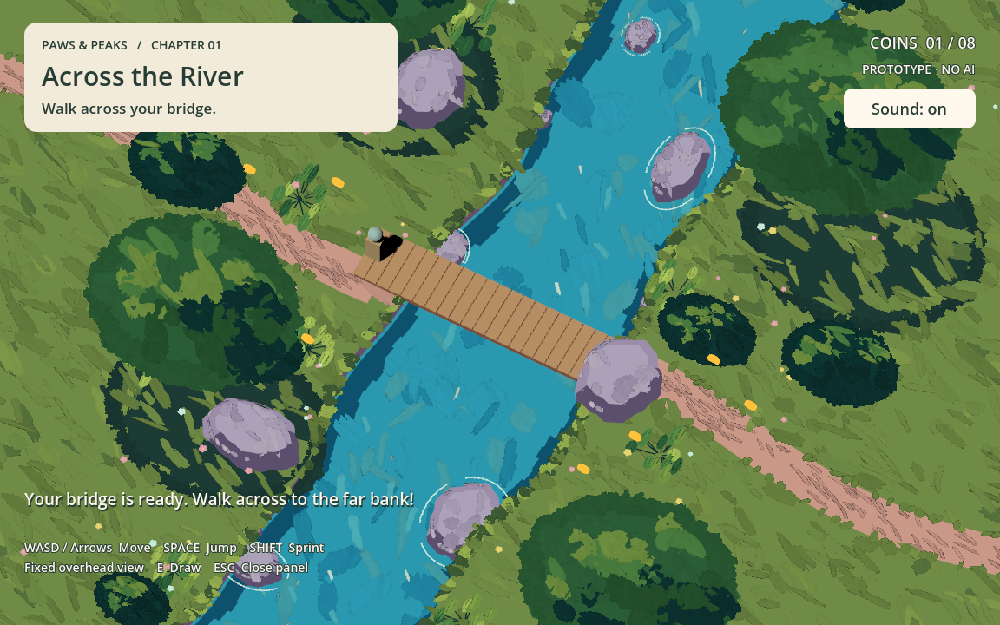

# Scene drawing and PNG handoff

Issue: [#12](https://github.com/AdeDeepFishing/Paws-Peaks/issues/12).
User decisions confirmed September 12, 2026. Implemented locally; real AI remains disconnected.

## Player flow

Approach the left riverbank until the pen button appears. E or a click opens the
transparent drawing overlay. Draw anywhere on the viewport except the bottom toolbar.
The normal HUD hides; the player and camera stay still; water continues playing.
Use Undo, Clear, Submit drawing, or Cancel / Escape. Cancel retains this level's draft.
Leaving the trigger hides the drawing entry, and returning restores access to the draft.

Submit freezes and exports the ink, hides the overlay, restores the HUD and resumes
movement. Processing uses a status message and Cancel generation button. A valid result
automatically places the encounter object even if the player has walked away; no preview
canvas, item card, or Use confirmation appears. Failures retain the draft for retry at
the riverbank. The bridge does not display the PNG as a paper texture. The selector remains explicitly labeled
NO AI because it controls the mock response. Reset clears the draft and request generation.

## Integration points

- `scenes/river/river_crossing.tscn`: `DrawingArea` configures the entry/usage region.
  Each level owns its draft surface; E01 continues to submit encounter ID `E01`.
- `scripts/river/drawing_surface.gd`: transparent ink, display-only light outline,
  pointer boundaries, fixed-proportion draft coordinates and cropped PNG rasterization.
- `scripts/river/river_level.gd`: pen prompt, entry checks, compact toolbar, HUD/input
  switching, automatic encounter result placement and the existing request boundary.
- The PNG uses RGBA: opaque black ink and fully transparent background. It is 512 × 512, cropped around
  ink with padding and scaled uniformly. No scene, UI or stroke outline is captured.
- Each submission writes a unique file under `user://drawings/`. The unchanged
  `DrawingRequest.request_prepared` signal carries `request_id`, `encounter_id`, and
  the immutable image in `image_base64`. Receiving it is separate from calling a provider.
- Stroke positions are screen-space drafts, not world coordinates or object placement.
  Window resizing uniformly fits the original draft and leaves export bytes unchanged.
  A new stroke after resizing still maps to the current pointer position.

## Verification and sample

The existing river smoke test now covers real viewport pointer input, toolbar exclusion,
area entry/exit, empty-submit rejection, Cancel/Clear, draft recovery, focus loss,
arrow-key and movement locks, continuing water animation, two canvas aspect ratios,
black/transparent pixels, padding and crop proportions, immutable request payloads, errors,
reset, and the complete physical bridge crossing. The visual run passed in Godot 4.7.2
Forward+ / Metal on Apple M1 at 1152 × 720 and a 960 × 800 canvas.

```sh
godot --path 3d_game --script res://tests/river_smoke.gd -- --visual
python3 backend/sketch_to_narrative/run.py \
  --image docs/assets/scene-drawing/bridge-input.png \
  --env-file backend/.env.example --request-id E01-overlay-sample --dry-run
```

The backend dry run reported `image_ready: true`. This verifies local PNG ingestion;
it does not verify paid recognition quality, live game-to-backend transport, or a
manual handoff on Beichun's device. No paid API call was made. Browser testing remains open.

The [sample PNG](assets/scene-drawing/bridge-input.png) was exported by the game renderer
from scripted test strokes; it is not a player research sample.





## Direct-result clarification — 2026-09-12

The desktop flow now implements PNG → Beichun's combined pipeline → returned GLB → scene.
See [desktop generation](DESKTOP_GENERATION.md) for issue #15, offline/live modes,
verification, and placement limits. The original bridge remains only in explicit mock
mode. No paid provider call was made during integration testing.



## Export update — 2026-09-12

The team replaced the earlier white-background decision with transparent-background
PNG export. Output remains 512 × 512, with black ink and transparent padding. The
backend receives the original RGBA PNG without flattening it onto white. Earlier
reference screenshots and sample PNGs above document the previous export.
