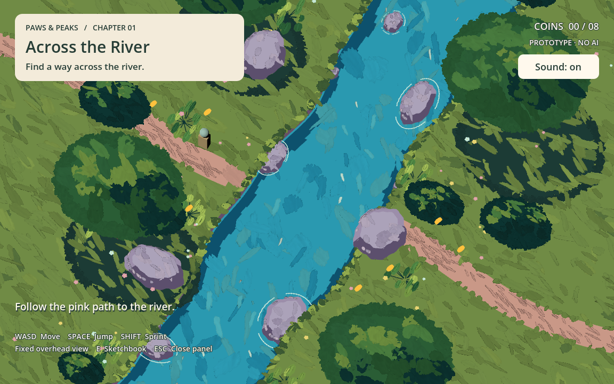

# Stage 01: storybook creek integration

Updated: 2026-09-12. The temporary otter preview has been removed. This scene
replacement is a review integration, not a claim of final art approval or Web readiness.

## Source

The user supplied `Downloads/stag01/storybook_creek.glb`. It is copied unchanged
into `3d_game/models/stage01/`; Godot extracts its embedded paint atlas alongside
it. Keep the GLB, extracted PNG, import settings and import script in version control.
The original generation scripts, reference images and video remain in Downloads.
The package reports 243 meshes, 192,321 triangles, and a six-second water loop.
Source authorship and license details have not been supplied.

## Camera decision

The team has superseded mouse orbit with a fixed composition for each stage.
E01 uses an overhead orthographic view based on the supplied camera, widened from
16 to 22 vertical units to show the player and both banks beneath the HUD.
`StageCamera` in `scenes/river/river_crossing.tscn` owns position, rotation,
projection and size. Designers can adjust that node directly; future levels can
supply their own Camera3D and composition without modifying the player controller.
The current camera stays in place while walking, jumping, drawing and restarting.

WASD or arrow keys follow the active camera's horizontal axes. Space jumps; Shift sprints.
The pointer stays visible and never controls the camera. E opens the sketchbook
near the left bank; Escape closes the panel. Drawing blocks movement and jumping.

## Art and gameplay wiring

- The imported scene replaces the old graybox scenery.
- `stage01_import.gd` enables vertex-color albedo on the delivered unlit materials.
  Godot 4.7.2 imported the shared materials with this flag off, causing white scenery.
  The post-import fix applies to editor and runtime and preserves source GLB bytes.
- `stage01_art.gd` creates mesh collision for meadow, cliff, boulder and branch meshes.
  Double-sided collision handles inconsistent mirrored-bank triangle winding.
  Paint stamps and water remain visual-only; water does not become a walkable surface.
- The delivered `Creek_HandDrawn` animation plays and loops; the MP4 is not used.
- Player spawn follows the delivered marker at `(-6.3, 1.5, -6.3)` in Godot coordinates.
  Drawing is available at the left shore, and the temporary bridge spans the creek
  along X. Completion is on the right bank. Coins are repositioned on both sides.
- Invisible outer boundaries keep this prototype's play area bounded. Falling into
  water returns to spawn while preserving drawings, requests and collected coins.
- The hiker and generated bridge remain placeholders. No later encounter is implemented.

## Verification

Run from the repository root:

```sh
godot --headless --path 3d_game --script res://tests/river_smoke.gd
godot --path 3d_game --script res://tests/river_smoke.gd -- --visual
```

The smoke test checks imported ground collision, fixed camera under mouse input
and movement, visible-pointer movement, jumping, diagonal speed, painted materials,
water animation playback, drawing input locks and PNG export, request lifecycle,
coin persistence, physical bridge crossing, completion and restart.

Runtime screenshots are captured with Godot 4.7.2 Forward+ / Metal on Apple M1.
Web export, browser performance, final prop collision simplification and LOD budgets
remain unverified. The bundled transparent paint geometry is relatively dense;
this integration has not established production performance targets.


