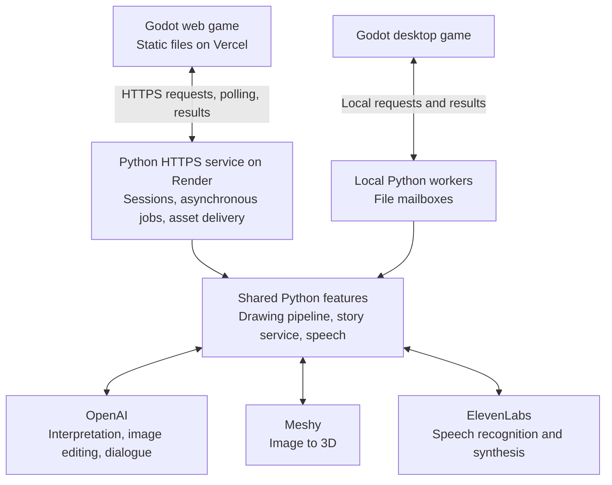
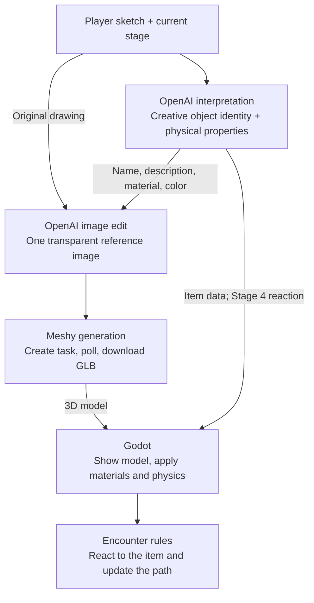
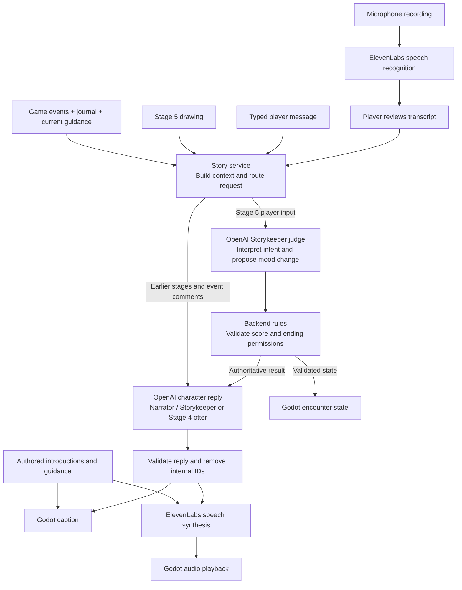

# Backend guide

The single backend reference for implementation, setup, stage contracts, testing,
benchmarking, and backlog. Game-side integration stays in
[Desktop Generation](../3d_game/DESKTOP_GENERATION.md); shared scope stays in [SPEC.md](../SPEC.md).

- [Public sketch-to-model interface](#sketch-to-model-interface)
- [Three-call flow](#three-call-flow), [current API steps](#current-flow), and [folder layout](#feature-layout)
- [Setup and run](#setup-and-run)
- [Stage classes and request contract](#current-multi-stage-request-contract)
- [Internal implementation and recovery](#internal-implementation)
- [Outputs](#outputs-and-recovery) and [local preview](#local-model-preview)
- [Tests and stage samples](#validation)
- [Benchmarking](#performance-profiling)
- [Development requirements](#contracts-and-failure-handling)
- [Samples and credits](#samples-and-credits)
- [Backlog](#backlog)
- [AI architecture diagrams](#ai-architecture)
- [AI prompt guide](AI_PROMPTS.md) — drawing, chat, evaluation, and voice
- [Generated examples](GENERATED_EXAMPLES.md)
- [Historical benchmarks](#historical-benchmarks)

## AI architecture

The game uses AI to interpret drawings, generate objects, write character replies,
and handle speech. Game code controls movement, encounter progression, and endings.

These diagrams describe the current code paths, not a verified hosted deployment.
For exact prompt behavior, see the [AI prompt guide](AI_PROMPTS.md).

### 1. Where the AI runs



Provider credentials stay in the Python environment. The browser receives results
and assets through the backend. Vercel serves the game; Render runs its AI requests.

Code: [web service](../../backend/web_service/server.py),
[desktop drawing bridge](../../backend/game_bridge/run.py),
[desktop story worker](../../backend/narrator_agent/run.py).

### 2. Drawing becomes a game object



The three AI stages run sequentially. Progress messages appear while the game
waits. A Meshy status poll checks the existing task; it does not create another model.

| Chapter | How the interpretation affects play |
| --- | --- |
| River | A fixed BRIDGE enables the implemented crossing. |
| Dog | FOOD or TOY distracts the dog. |
| Bird | DEFENCE provides cover; BOW or MAGIC scares the bird away. |
| Otter | No classification: AI returns happiness, a reply, and an animation choice. |
| Storykeeper | The object can be generated while a separate dialogue evaluation considers the drawing's meaning. |

Recognizing an imaginative object does not automatically mean it solves an
encounter. UNKNOWN is a compatibility fallback, not a reason to stop generation.

Code: [pipeline](../../backend/sketch_to_model/run.py),
[interpretation](../../backend/interpret/run.py),
[image prompt](../../backend/image_edit/prompts.py),
[stage classes and hints](../../backend/stage_config.py).

### 3. Chat, narration, and voice



Voice input becomes the same text used by chat; it does not use a separate
conversation model. Stage 4 chat uses the otter persona. Stage 5 player input
normally uses two model calls: a judge followed by the character's reply.
Event comments do not earn mood points.

The journal supplies confirmed memories. The backend clamps mood, opens the
exit at 95, and requires confirmation for a stay ending. Godot applies the
returned state. Authored lines can skip dialogue generation but still use TTS.
Loading messages are UI status, not narrated dialogue.

Code: [context, routing, and state rules](../../backend/narrator_agent/service.py),
[judge and character prompts](../../backend/narrator_agent/model.py),
[transcription](../../backend/speech/transcribe.py),
[speech synthesis](../../backend/speech/service.py),
[game narrator](../../3d_game/scripts/narrator/narrator.gd).

## Sketch-to-model interface

**Sketch-to-model is the public object-generation interface.** Narration uses a separate bounded story service described under [Narrator and speech](#narrator-and-speech). The game submits one
sketch and its stage identity, then receives item data and generated assets.
`interpret/`, `image_edit/`, and `model_generation/` are internal steps; callers do
not invoke them separately or supply provider prompts, keys, or class lists.

### Transport and lifecycle

The current desktop transport is a local file mailbox, not an HTTP endpoint.
Godot's `GenerationWorker` autoload starts the Python bridge once at game startup;
`game_bridge/run.py` is the transport adapter for sketch-to-model, not another
public generation service. Starting the drawing listener alone makes no provider calls; gameplay can separately request narration and speech.

1. Create a unique request directory inside the running worker's directory.
2. Save the drawing bytes as `request/input.png` before publishing the request.
3. Write `request/request.tmp`, close it, and atomically rename it to `request/request.json`.
4. Read `status.json` for the latest response; the game polls every 0.2 seconds.
   `response/results.jsonl` retains the timestamped response history.
5. Stop waiting when `status` becomes `SUCCEEDED` or `FAILED`. Ignore responses
   whose request, encounter, or game-stage identity no longer matches the session.

The worker claims `request/request.json` as `request/claimed.json` and prevents duplicate execution
with `started.lock`. To cancel local waiting, create a `cancel` marker in the job
directory. Cancellation is reported as `FAILED` with `error: CANCELED` at a progress
boundary; it does not guarantee cancellation of an already-submitted provider job.
The browser HTTP adapter is implemented in `backend/web_service/server.py`. See
[Web deployment](../3d_game/WEB_DEPLOYMENT.md) for contracts, limits, hosting, and
verification status. The desktop mailbox below remains supported.

### Example request

Stage 1 (River), live generation:

```text
<worker-directory>/E01-example/
  request/
    input.png
    request.json
  response/
    results.jsonl
    artifacts/       # Live model, reference image, and retained pipeline files
  status.json        # Latest status and arrival timestamps
```

`request/request.json`:

```json
{
  "request_id": "E01-example",
  "encounter_id": "E01",
  "game_stage": "river",
  "mode": "live"
}
```

| Input | Contract |
|---|---|
| `request_id` | Unique string for this submission; 1–100 ASCII letters, digits, underscores, or hyphens |
| `encounter_id` | `E01`–`E05`, matching the selected game stage |
| `game_stage` | `river`, `dog`, `crows`, `otter`, or `storykeeper`; see [stage mapping](#approved-classes) |
| `mode` | `live` runs the three paid generation steps; `fixture` returns saved sample assets without provider calls, bundled for River and Dog; Otter can replay a completed local live request; Bird/Storykeeper have no fixture |
| `animation_options` | Stage 4 map of playable animation keys to their saved descriptions, validated against the otter catalog and supplied to the first AI call; other stages omit it |
| `request/input.png` | One drawing in the request directory, supplied separately from JSON; game-generated PNG, at most 1 MiB |

`stage_number` is backend configuration, not a request field. The desktop request contains
no image URL, Base64 field, provider credentials, or second image. The HTTP adapter
instead accepts `image_base64` and only live generation; it returns scoped asset URLs
rather than local paths. Two-image support
is [backlogged](#backlog).

### Example response

An illustrative completed `status.json` for the request above follows. Paths and
time are example values, not a recorded live run. Real paths are absolute local
paths within the originating job directory; live generated assets are under its
`response/artifacts/` subdirectory. Fixture assets are directly under `response/`.

```json
{
  "schema_version": 1,
  "request_id": "E01-example",
  "encounter_id": "E01",
  "game_stage": "river",
  "mode": "live",
  "input_path": "/example/worker/E01-example/request/input.png",
  "stage": "complete",
  "status": "SUCCEEDED",
  "item": {
    "name": "A little bridge",
    "description": "A sturdy little bridge ready to span the creek.",
    "type": "BRIDGE",
    "movable": false,
    "mass_kg": 200,
    "placement": "fixed",
    "texture_key": "wood",
    "color": "#B88755"
  },
  "reference_path": "/example/worker/E01-example/response/artifacts/reference.png",
  "model_path": "/example/worker/E01-example/response/artifacts/model.glb",
  "request_received_at": 1789257600.0,
  "response_received_at": 1789257620.0,
  "updated_at": 1789257620.0,
  "pool_checked": true,
  "pool_return_code": 0
}
```

| Response field | Meaning |
|---|---|
| `schema_version` | `1` for the game-facing sketch-to-model status |
| Identity fields | Echo the originating `request_id`, `encounter_id`, `game_stage`, and `mode` |
| `stage` | Progress: `starting`, `description`, `reference_image`, `model`, `preview`, `complete`, or `error` |
| `status` | `PENDING`, `SUCCEEDED`, or `FAILED` |
| `reaction` | Stage 4 only: selected animation key, published with the item and retained through completion |
| `otter_happy`, `otter_response` | Stage 4 only: boolean happiness and a nonblank otter reply of at most 160 characters |
| `item` | Validated interpretation; appears before model completion; [field bounds](#item-validation) |
| Asset paths | `reference_path`, `model_path`, and `preview_path` appear as assets become available |
| `request_received_at` | Unix seconds when the backend observes the published request, before queueing; retained through completion |
| `response_received_at` | Unix seconds when the latest result or terminal failure reaches the bridge; `null` until a result arrives; pool verification preserves it |
| `updated_at` | Unix timestamp in seconds, updated for each published response |
| `error` | Sanitized error code on failure; no raw provider response |
| `preview_error` | Optional `PREVIEW_RENDER_FAILED`; the GLB can still succeed without `preview_path` |
| `pool_checked`, `pool_return_code` | Added after the listener checks the completed job; may be absent on the first terminal response |

Receipt is published immediately, even when another job is running. Arrival timestamps
use the backend clock, not provider generation clocks; benchmark durations use a
monotonic clock. Each new item/asset or terminal result updates `response_received_at`,
and its previous value remains in `response/results.jsonl`. The request, response,
and status paths stay within one unique job directory.

Progress snapshots are cumulative: a `PENDING` response can already contain `item`
or `reference_path`. The frontend may display these early, but should wait for
`SUCCEEDED` before treating the model as ready. Preview failure preserves model
success. No credentials or signed provider URLs enter this response.

Example failure before any item or generated asset becomes available:

```json
{
  "schema_version": 1,
  "request_id": "E01-example",
  "encounter_id": "E01",
  "game_stage": "river",
  "mode": "live",
  "input_path": "/example/worker/E01-example/request/input.png",
  "stage": "error",
  "status": "FAILED",
  "error": "SERVICE_UNAVAILABLE",
  "request_received_at": 1789257600.0,
  "response_received_at": 1789257601.0,
  "updated_at": 1789257601.0
}
```

Common failures include `INVALID_REQUEST`, `STAGE_NOT_CONFIGURED`,
`FIXTURE_NOT_AVAILABLE`, `SERVICE_UNAVAILABLE`, `RATE_LIMITED`, `OPENAI_IMAGE_ERROR`,
`INVALID_MODEL_OUTPUT`, `GENERATION_FAILED`, `CONFIG_ERROR`, `POLL_TIMEOUT`, and
`CANCELED`. Failed snapshots may retain earlier successful fields.

`status: FAILED` with `error` and the originating `request_id` is the backend's
terminal failure signal. The desktop adapter handles it before partial results,
clears the failed result, and transitions `DrawingRequest` to `FAILED`. It emits
`request_failed(request_id, error_code, message)` so game callers can react explicitly.
The current encounter UI displays the message and allows drawing again; the saved
sketch is retained. A new submission gets a fresh request ID, and late responses
from the failed request are ignored. Do not resubmit automatically: remote generation
may still exist after a timeout.

### Local command-line entry point

For manual callers, use the same sketch-to-model operation:

```sh
backend/.venv/bin/python backend/sketch_to_model/run.py --image backend/tests/stage1/input.png --game-stage river --dry-run
```

Remove `--dry-run` to generate with providers. The direct CLI prints pipeline
JSON events to stdout and diagnostics/profiles to stderr; it does not emit the
mailbox's version-1 envelope or accept `request.json`. Game callers use the mailbox
contract above. The [stage runner](#validation) selects bundled samples and adds
benchmark logs to this same operation.

## Three-call flow

Interpretation makes a creative, common-sense guess from the drawing and scenario.
Wild, magical, and hybrid objects are welcome. Stages 1–3 classify the result;
Stage 4 returns `item`, `reaction`, `otter_happy`, and `otter_response`, without
`item.type`. Stage 5 uses `type: UNKNOWN`; its separate story service judges meaning.
The prompt requests this reasoning order; offline tests verify the contract and
routing, not the model's actual reasoning or recognition quality.

Repeated code-formatted names below denote the same data passed between calls:
`SKETCH` is the original PNG/JPEG, `ITEM` is the interpretation result's `item`,
`REFERENCE_IMAGE` is the generated object-reference PNG, and `MODEL_TASK_ID`
identifies the Meshy job.

| AI call | Input | Output |
|---|---|---|
| **1. Interpret** | `SKETCH` + interpretation prompt + stage classes (Stages 1–3) or animation descriptions (Stage 4) | `{ "item": ITEM }`, where `ITEM` contains `name`, `description`, `type`, `movable`, `mass_kg`, `placement`, `texture_key`, and `color`; Stage 4 omits `type` and adds `reaction`, `otter_happy`, and `otter_response`; Stage 5 uses `UNKNOWN`; no `status` field |
| **2. Image edit** | `SKETCH` + `ITEM.name` + `ITEM.description` + `ITEM.texture_key` + `ITEM.color` + style instructions + image settings | `REFERENCE_IMAGE`: one 816 × 816 object-reference PNG, prompted to use `ITEM.color` as its dominant base color |
| **3. 3D generation** | `REFERENCE_IMAGE` + Meshy T2 settings: target 500 faces, no textures, GLB format | `MODEL_TASK_ID`: task ID used to retrieve the model |

Within the single interpretation call, imagine a concrete object from the sketch,
making a creative best-effort guess even when confidence is low.
When several identities fit the strokes, use the scenario and named class examples
(excluding `UNKNOWN`) as hints. Respect clear drawings and allow ideas outside the
examples. In Stages 1–3, classify the identified
object using the stage's allowed classes; use `UNKNOWN` if none fits. Stage 4
selects an otter reaction instead, with no object class. Ambiguity alone does
not stop generation. Also classify mobility from the identified object: portable
or loose objects use `movable: true`; fixed structures use `movable: false`.
API failures and invalid responses remain errors.

After the three AI calls, status polling takes `MODEL_TASK_ID` and returns task
status/progress plus `MODEL_GLB_URL` on success. Downloading `MODEL_GLB_URL` returns
the GLB bytes saved as `model.glb`. Polling and downloading are additional HTTP
requests, not additional AI generation calls.

## Current flow

The three calls run sequentially. See [item validation](#item-validation) for the
implemented schema.

| Call | Endpoint | Provider encoding |
|---|---|---|
| Interpret | `POST https://api.openai.com/v1/responses` | Sketch as an `input_image` data URI; strict `drawing_interpretation` JSON schema; `store: false`, `max_output_tokens: 800`, `detail: auto` |
| Image edit | `POST https://api.openai.com/v1/images/edits` | Original sketch in multipart field `image`; response PNG in `data[0].b64_json` |
| 3D generation | `POST https://api.meshy.ai/openapi/v1/image-to-3d` | Reference PNG data URI in `image_url`; response task ID in `result` |

The interpreted item is available before image editing starts. The bridge publishes
cumulative item, reference-image, model, and preview updates; see the
[public interface](#sketch-to-model-interface). All five chapters display
the early interpretation and reference image through their shared
[generation overlay](../3d_game/DESKTOP_GENERATION.md#lifecycle-and-files).
Game requests skip the PNG preview and render the GLB in Godot; standalone CLI
runs render a local preview unless `--skip-preview` is supplied.

For model/image defaults and overrides, see [Setup and run](#setup-and-run).
For polling, artifacts, and retry behavior, see [Outputs and recovery](#outputs-and-recovery).
Prompt locations and adapter responsibilities are listed under
[Code ownership](#code-ownership-and-cleanup).

The backend uses local Python 3.9+ scripts and the shared `backend/.venv` and ignored
`backend/.env`. The desktop game starts the persistent listener with
`backend/game_bridge/run.py --serve`; a Web export cannot launch Python. See
[desktop integration](../3d_game/DESKTOP_GENERATION.md).

## Feature layout

```text
backend/
  .env                        # Ignored local credentials shared by features
  .env.example                # Tracked blank configuration template
  .venv/                      # Ignored shared Python environment
  narrator_agent/             # Story journal, referee, performer, mailbox and authoring bench
  speech/                     # ElevenLabs speech with per-character voice routing
  stage_config.py             # Backend-owned class sets for all four game stages
  game_bridge/run.py          # Persistent request listener and result logs
  utils/
    render.py                 # Local GLB-to-PNG renderer
    common.py                 # Local configuration and PNG/JPEG input helpers
    profiling.py              # Optional command/stage timing and JSON reports
  sketch_to_model/
    run.py                    # Primary sketch -> description -> reference -> T2 flow
  interpret/                  # API step 1
    run.py                    # OpenAI: image -> narrative and game item JSON
    prompts.py                # Pipeline interpretation instructions
  image_edit/                 # API step 2
    run.py                    # OpenAI: sketch + prompt -> reference image
    prompts.py                # Style and reference-image prompt
  model_generation/           # API step 3
    run.py                    # Meshy: image -> untextured mesh job/status/GLB
  samples/banana.jpg          # Shared development input
  tests/                      # Offline tests for the pipeline and adapters
  output/                     # Ignored job manifests and generated models
```

## Setup and run

Run all commands below from the repository root. Python 3.9+ and its standard
library are sufficient. Create the shared environment if needed:

```sh
python3 -m venv backend/.venv
if [ ! -e backend/.env ]; then
  cp backend/.env.example backend/.env
fi
chmod 600 backend/.env
```

Open the ignored `backend/.env` in your editor and fill in the keys. Keep tracked
credential examples blank:

```dotenv
OPENAI_API_KEY=
OPENAI_MODEL=gpt-4.1-mini
MESHY_API_KEY=
MESHY_MODEL=meshy-6
```

The two providers use separate accounts/credits. OpenAI credentials need access
to Responses and image editing. Environment variables override `.env`; values
are literal single lines with optional surrounding quotes. Full-line comments
are supported; inline comments and shell expansion are not. Paths to local
configuration resolve from the backend directory.

Validate offline first. The second command below makes paid requests:

```sh
backend/.venv/bin/python backend/sketch_to_model/run.py --dry-run
backend/.venv/bin/python backend/sketch_to_model/run.py
```

The default source is `tests/fixtures/sketches/E01-2026-09-12T15-55-03-58aa7d14598ccf2b.png`.
Use `--image path/to/sketch.png` for another input. Each live invocation makes one
OpenAI interpretation request, one OpenAI image edit, and one Meshy creation after
preceding stages succeed. Ambiguity is handled by a best-effort object guess;
invalid responses and provider errors stop the pipeline. There are no creation retries.

| Stage | Default settings |
|---|---|
| Interpretation | Configured `OPENAI_MODEL` (default/template: `gpt-4.1-mini`), strict item JSON schema |
| Reference image | `gpt-image-2.5-flare`, **816 × 816**, low quality, transparent PNG |
| 3D | `meshy-t2`, Smart Topology, target **500 faces**, GLB, **textures disabled** |

Options: `--style-prompt` replaces the reference-image instructions;
`--openai-image-model` overrides Flare; `--openai-image-size 1024x1024` compares the
larger reference image.
`--target-faces` changes the T2 target (100–15,000; default 500).
The lower face target favors lightweight geometry. The single textured comparison
was faster at 500 faces, but does not isolate the face-count effect. Use
`--target-faces 1000` to reproduce the earlier geometry setting.
Texture experiments and their measured performance are retained in
[Generated examples](GENERATED_EXAMPLES.md).

`OPENAI_MODEL` configures interpretation in both this pipeline and the standalone
interpretation CLI. The standalone adapter's `MESHY_MODEL` setting does not override the
pipeline's T2 model.

The image prompt preserves the sketch and description, asks for the whole object with
10% margins, and avoids decorative detail. These are model instructions, not enforced
visual guarantees. The accepted 816-pixel test changed triangular braces into ladder
rungs; intent and structural fidelity still need human review.

### Reusable material palette

Interpretation selects `texture_key` from the 15 keys in
`3d_game/assets/materials/palette.json` and returns an opaque `color` in `#RRGGBB`
format. That same catalog supplies the prompt descriptions, schema enum and game
material properties. Invalid keys and malformed colors fail validation.

Image edit uses the same material key and color to guide the reference's dominant
base color. Godot tints the bundled tile and applies it across the untextured mesh
with local triplanar mapping. No extra image call is needed.

See [Material palette](../3d_game/MATERIAL_PALETTE.md) for rendering, asset sizes,
keys, preparation, provenance and verification limits.

## Current multi-stage request contract

**All five stages share the generation pipeline. The backend owns class sets:
Stages 1–3 use encounter classes, Stage 4 returns an otter reaction without a
class, and Stage 5 uses UNKNOWN. The game never supplies a class list.**

### Approved classes

Stages 1–3 were confirmed on September 13, 2026. Stage 4 classification was removed on September 14. Class labels are case-sensitive.
Each configuration entry also defines `stage_number` (1–5); the bridge uses this
number to select the River or Dog fixture; Otter replay uses saved local results. Requests still send the named
`game_stage`, which the backend resolves through this configuration.
The executable source of truth is [`backend/stage_config.py`](../../backend/stage_config.py).

| Stage number | `game_stage` | `encounter_id` | Allowed `item.type` values |
|---|---|---|---|
| 1 — River | `river` | `E01` | **`BRIDGE`, `BOAT`, `UNKNOWN`** |
| 2 — Large Dog | `dog` | `E02` | **`FOOD`, `TOY`, `WEAPON`, `UNKNOWN`** |
| 3 — Crows | `crows` | `E03` | **`BOW`, `MAGIC`, `DEFENCE`, `UNKNOWN`** |
| 4 — Otter | `otter` | `E04` | No `type`; returns reaction, happiness, and reply |
| 5 — Storykeeper | `storykeeper` | `E05` | **`UNKNOWN`** |

These are separate allowed sets, not one combined enum. For example, `FOOD` is valid
for Dog but invalid for Crows; `BOW` is valid for Crows but invalid for Dog. The AI
must classify within the selected stage's categories. It must not borrow a category
from another stage. Stage 5 retains `UNKNOWN` for response compatibility; its
separate Storykeeper evaluation decides the outcome, not this class.

`UNKNOWN` means the identified or guessed object fits none of the stage's named
categories. It has the usual item fields and continues through generation. Every
classified stage (1–3 and 5) must include this fallback. Low confidence alone does not stop generation.

### Request and routing

Use the [public sketch-to-model request](#example-request). `game_stage` names the
game challenge; response `stage` describes pipeline progress. Their meanings are
different. `game_stage` and `encounter_id` must match the table above.

The persistent Python listener validates the request and queues its job. The selected
class set for Stages 1–3 and 5 is passed through to OpenAI interpretation and checked in three places:

1. The prompt presents named classes as examples, excluding UNKNOWN, and explains the fallback.
2. The strict JSON schema sets `item.type.enum` to exactly that class set.
3. Backend response validation rejects any type outside the selected set.

Godot validates request/stage identity, field types, string lengths and file paths.
It does not maintain a second validation enum. New classes can pass the response
interface, but supporting new solutions also requires changing Godot encounter logic.

### Shared generation and results

Every item contains `name`, `description`, `movable`, `mass_kg`, `placement`,
`texture_key`, and `color`. Stages 1–3 and 5 also require `type`. Stage 4 adds
reaction/happiness/reply fields outside the item. Combat stats and capability tags
are not part of the contract.

As each result becomes available, the worker appends a cumulative record to
`response/results.jsonl` and atomically updates `status.json`. Results include local paths:

| Field | File |
|---|---|
| `input_path` | Original sketch |
| `reference_path` | Generated reference image |
| `model_path` | Downloaded GLB |
| `preview_path` | Locally rendered PNG |

Every update retains request identity, `game_stage`, progress `stage`, status and an
`updated_at` timestamp. The listener checks finished thread-pool jobs against the
status file and records `pool_checked` and `pool_return_code`. Provider credentials,
signed download URLs and raw provider errors are excluded from these game-facing logs.

Godot polls every 0.2 seconds. Item and reference-image signals can arrive before
completion. Live game requests publish `SUCCEEDED` after the GLB download and skip
the preview. Standalone CLI runs and River/Dog fixtures render a preview; its failure
still delivers the GLB with `preview_error`. Otter replay copies saved model/reference assets. See [desktop integration](../3d_game/DESKTOP_GENERATION.md)
for worker lifetime, cancellation and scene integration.

### Classification is not challenge completion

Being a valid class does not guarantee that an object solves the challenge. Gameplay
rules are evaluated separately in Godot. River currently accepts `type: BRIDGE`
with `placement: fixed`
for its fixed crossing, with placement committed once per encounter. Recognizing `BOAT` does not
implement boat movement. Stage 2 renders every returned class, but only FOOD and
TOY distract the dog and unlock the path. Other classes permit another sketch; submitting
replaces the previous object. Stage 4 applies offering happiness after model
placement; Stage 5 uses the story service mood/ending rules.

Stage 3 adds backend-owned meanings for its classification step: an identified
ordinary umbrella, parasol, shield, helmet or protective cover belongs to DEFENCE,
including protection from weather or animals. The model still identifies the
sketch using its visual evidence, with scenario context helping resolve ambiguity.
River requires a fixed BRIDGE and Dog accepts FOOD or TOY. Bird accepts DEFENCE
through raised protection, or BOW and MAGIC through a scare-away departure.
UNKNOWN still allows a retry without clearing the path.
This addresses the September 13 #59 playtest, where generated umbrellas were
classified UNKNOWN. Offline request tests verify the guidance is sent only for
Stage 3; new live classification accuracy has not been measured.

### Changing a class set

Edit the stage's `classes` tuple in `backend/stage_config.py`, update this table
and the relevant specification section. Review scenario hints and Godot encounter
logic if the new class should solve the challenge, then run:

```sh
backend/.venv/bin/python -m unittest discover -s backend/tests -v
```

Restart the game to reload the persistent worker's configuration. Test generation
without providers using River fixture mode. For a local configuration/input check:

```sh
backend/.venv/bin/python backend/sketch_to_model/run.py --game-stage crows --dry-run
```

A missing class set fails with `STAGE_NOT_CONFIGURED` before provider calls. An invalid
stage/encounter pair fails with `INVALID_REQUEST`; an unavailable offline fixture
fails with `FIXTURE_NOT_AVAILABLE`. No paid generation is automatically retried.

### Item validation

Stages 1–3 and 5 return exactly `{ "item": { ... } }`. Stage 4 returns
`{ "item": { ... }, "reaction": "Shrug", "otter_happy": false, "otter_response": "That is a curious gift!" }`,
omitting `item.type`. The reaction must be an exact catalog key; happiness is a
boolean and the reply is nonblank, at most 160 characters. Both forms omit
`status` and require a non-null item; additional properties are rejected:

| Field | Validation |
|---|---|
| `name` | Nonempty string, at most 40 characters |
| `description` | String, at most 160 characters |
| `type` | Stages 1–3: one allowed class; Stage 5: UNKNOWN; absent in Stage 4 |
| `mass_kg` | Number from 0.05 to 1000; booleans and nonfinite values rejected |
| `placement` | One of `drop`, `fixed`, `float` |
| `movable` | Boolean: `true` for loose/portable objects, `false` for fixed structures |
| `texture_key` | One key from the shared 15-material palette |
| `color` | Opaque hex tint matching `^#[0-9A-Fa-f]{6}$` |

`attack_power`, `range`, `speed`, `durability`, and `tags` are removed from the
schema and are no longer requested from OpenAI. The backend requires eight item fields in Stages 1–3 and 5, seven in Stage 4.
Godot retains compatibility defaults for older mass/placement responses. Saved historical results may contain the old fields; the
fixture adapter projects its retained sample onto the current contract.

The standalone interpretation CLI adds `schema_version: 2` and `request_id` to the
interpretation result. The desktop adapter separately supplies `status: recognized` to
the existing Godot drawing-request interface; worker progress statuses such as
`PENDING` and `SUCCEEDED` remain unchanged. The Meshy task manifest uses version 1. Neither is interchangeable with the
worker's cumulative progress records. Preserve the originating request identity.

## Internal implementation

The three provider adapters are implementation details of sketch-to-model. Their
Python functions and maintenance CLIs are not separate game-facing interfaces.

| Step | Internal function | Responsibility |
|---|---|---|
| Interpret | `interpret.run.interpret()` | One OpenAI Responses request, followed by item validation |
| Image edit | `image_edit.run.generate()` | One OpenAI multipart image-edit request, followed by PNG validation |
| Model generation | `model_generation.run.create_job()` | One Meshy submission with durable task identity |

Interpretation has a 15-second socket timeout; image editing has 180 seconds;
Meshy requests/downloads have 30 seconds. These are socket limits, not guaranteed
end-to-end deadlines. The shared input helper validates PNG/JPEG signatures and
size rather than fully decoding images. Interpretation uses `store: false`, which
is not a promise of zero provider retention.

### Model generation and recovery

The pipeline polls the submitted task and downloads its model. New manifests use
`model_generation`; existing `image_to_3d` and `image_text_to_3d` manifests remain
readable. Maintenance tooling may inspect an existing manifest using its original
path; do not create another task merely to check status or download an output.

`SUBMITTING` or `SUBMISSION_UNKNOWN` can mean the provider accepted work before
the connection failed. Check the provider dashboard and recover its task identity
before deliberately submitting again. Stopping local work does not cancel the
provider job. Model-job manifests are internal files and are not public responses.

Downloads use HTTPS `assets.meshy.ai` without forwarding provider credentials,
enforce a 64 MiB limit, validate the GLB header/version/declared length, and preserve
existing output files. These checks do not establish full glTF validity or quality.

## Outputs and recovery

Game mailbox jobs keep inputs under `request/`, response history and fixture assets
under `response/`, and live pipeline files under `response/artifacts/`. `status.json`,
`started.lock`, and the optional `cancel` marker remain at the job root. The pipeline
continues to retain its validated input copy alongside its generated artifacts.

The standalone pipeline and stage runner retain their own output layout below;
they do not submit through the game mailbox.

Outputs are saved under ignored `backend/output/sketch_to_model/<run-id>/`:
`input.png` (or `input.jpg` for JPEG sources), `description.json`, `reference_prompt.txt`, `image_edit_settings.json`, `reference.png`,
`model_job.json`, `model.glb`, and `model.png` (a 512 × 512 rendered model preview). The edited PNG enters T2 as a data URI. Local
PNG/JPEG input and the generated transparent PNG must fit the existing 1 MiB image limit.

Stage results and local paths print as JSON lines on stdout. Diagnostics and profiles
go to stderr; profiles also save under `backend/output/profiles/`. Credentials and
signed URLs must not be printed. The Meshy manifest can contain a signed URL and must
stay local. Image-edit settings contain the submitted prompt and non-secret generation settings.
The bridge publishes item JSON immediately after interpretation and the local reference
path immediately after image editing. Each request retains timestamped cumulative
updates in `response/results.jsonl` and the latest atomic snapshot in `status.json`, including
local image/model paths. The listener checks completed thread-pool jobs against the
final status and records `pool_checked`/`pool_return_code`; crashes and missing final
results are logged as failures without retries.

Meshy status polling calls `GET /openapi/v1/image-to-3d/{task_id}` immediately after
submission, then sleeps 0.1 seconds after each unfinished response. Request starts
are separated by the preceding request's duration plus 0.1 seconds. The loop has a
600-second deadline; an in-flight request can run past it. A successful response
provides the download URL in `model_urls.glb`; `FAILED` or `CANCELED` stops the loop.
OpenAI image editing
has a 180-second socket timeout, not a guaranteed completion deadline. Restarting
the pipeline creates new paid work. On failure, inspect existing outputs and recover
the Meshy task using the [internal recovery tooling](#model-generation-and-recovery) instead of
blindly rerunning. `SUBMISSION_UNKNOWN` indicates an uncertain paid submission.

## Local model preview

In standalone CLI runs without `--skip-preview`, the pipeline renders `model.png` beside it using the
standard-library CPU renderer in `backend/utils/render.py`. This is a
clay-shaded view of the actual static geometry, with automatic framing and a light
background; it does not reproduce textures or the game scene. No AI call, GPU,
window, or additional package is needed. Completion includes `preview_path`; a
preview failure includes `preview_error: PREVIEW_RENDER_FAILED` while preserving
the successful GLB. The game bridge applies the same step to offline fixtures.

Render an existing file without running generation:

```sh
backend/.venv/bin/python backend/utils/render.py path/to/model.glb
```

Local 512-pixel preview tests took 0.07–0.48 seconds; both outputs were visually
inspected. The renderer handles static
triangle meshes with node transforms and embedded position/index buffers. Skins,
morph targets, sparse accessors and required extensions are unsupported.

## Validation

```sh
backend/.venv/bin/python -m unittest discover -s backend/tests -v
```

Latest local verification (September 17): **82 offline tests passed**, covering
interpretation, image editing, model jobs/downloads, game handoff, web sessions,
narrator state and evidence, speech, credentials, routing, profiling, and previews.
This does not verify provider output quality or a complete hosted playthrough. Stage sample images remain
under `backend/tests/stage1/` through `stage4/` for the manual runner below.

Run only the pipeline checks during focused flow work:

```sh
backend/.venv/bin/python -m unittest discover -s backend/tests -p test_sketch_to_model.py -v
```

Each stage folder contains an input image for the manual pipeline runner:
Stage 1 reuses Yanwen's saved river sketch
(`tests/fixtures/sketches/E01-2026-09-12T15-55-03-58aa7d14598ccf2b.png`),
Stages 2 and 4 contain synthetic line drawings of a bone and a wrapped gift.
Stage 3 uses an AI-generated black-line umbrella sketch. Recorded model results
are in [generated examples](GENERATED_EXAMPLES.md); sample images alone do not
establish gameplay outcomes.

Validate a sample offline:

```sh
backend/.venv/bin/python backend/tests/stage_test.py --stage1 --dry-run
```

Submit that image through the existing sketch-to-model pipeline (paid OpenAI and
Meshy calls, requiring local credentials):

```sh
backend/.venv/bin/python backend/tests/stage_test.py --stage1
```

Replace `--stage1` with `--stage2`, `--stage3`, or `--stage4`; exactly one stage is
required. Image paths resolve relative to the script, including when run outside
the repository. The pipeline builds provider requests using the selected image
and backend stage classes, retaining the original image and results under ignored
`backend/output/sketch_to_model/<run-id>/`. This manual runner is excluded from
unittest discovery; automated routing tests mock its pipeline calls.

Historical palette verification (September 13): the then-20-test offline backend suite and desktop-generation
smoke passed. Godot reported two ObjectDB instances at desktop-test shutdown.
Saved Stage 2 material replays and the UNKNOWN flower render/retry check passed.
The broader dog smoke has patrol and sketch-placement failures; it is not a passing
check for this branch. Live color matching remains unmeasured. Historical provider
timings and their limitations are recorded in [Generated examples](GENERATED_EXAMPLES.md).

## Performance profiling

The sketch-to-model pipeline profiles automatically. Use its stage runner for
an offline check or a benchmarked live submission:

```sh
backend/.venv/bin/python backend/tests/stage_test.py --stage1 --dry-run
backend/.venv/bin/python backend/tests/stage_test.py --stage1
```

The second command uses provider credits. No separate calls to the internal API
steps are needed.

Each profiled invocation prints a `PROFILE` JSON record to stderr and saves the same
record under `backend/output/profiles/<unique-run-id>.json`. Stdout retains its normal
result/error JSON, so Godot and output redirection continue to work. Profiles contain
request/task IDs and numeric measurements, never keys, images, prompts, or asset URLs.
A profile-file write failure does not fail a successful generation or download.

Reports include:

- `command_wall_ms`: elapsed time after argument parsing through completion/error handling,
  excluding interpreter startup/imports and profile-output overhead.
- `local_cpu_ms`: CPU time used by this local Python process, excluding remote computation.
- `timings_ms` and `stage_calls`: local configuration/image preparation, API round trips,
  response validation, and model download/header validation/file writing as applicable.
  Timings use a monotonic clock and still record stages that fail or time out.
- `request_body_bytes` and `response_body_bytes`: JSON payload sizes excluding HTTP headers;
  Base64 inflation is included. URL mode does not measure the provider's image fetch.
- `download_bytes` and `download_mib_per_second`: GLB transfer size and effective throughput,
  including connection setup and server wait, available after a download response is read.
- `server_queue_ms`, `server_processing_ms`, `server_total_ms`: Meshy task durations derived
  from its positive, ordered `created_at`, `started_at`, and `finished_at` timestamps.
  Missing, zero, or invalid intervals are omitted rather than presented as zero time.

API round-trip time includes network setup, upload, provider waiting/processing, and response
download; it is not an isolated inference benchmark. Meshy server processing can include
remeshing. Its creation request returns before model generation completes. To measure the
completed task, profile `status` or `download` after it finishes. Durations use only the
provider's clock; manual delays between CLI commands do not inflate server timings.

Profiling makes no additional API calls or automatic retries. A profiled `create` still
creates one paid job; a profiled `--dry-run` makes no network requests. Dry-run timings
are setup measurements, not live API performance. GPU/RAM usage, actual mesh face counts,
and Godot import/render performance are not measured by this helper.

### Stage benchmark logs

Live stage runs immediately print `BENCHMARK` JSON records to stderr and append
those records to `benchmark.jsonl` beside the run's input and outputs. Records
include UTC timestamps, elapsed milliseconds since run start, operation duration,
stage identity, and run ID. Each OpenAI interpretation/image-edit response, Meshy
submission/status poll, and model download is logged as its adapter returns.
Failed calls are labeled `api_failure`, and `run_finished` records total time and
exit status. No response bodies, credentials, or signed URLs enter this log.
These are client-observed completion times, including adapter validation/local
writes, not exact provider generation timestamps. Meshy polling intervals count
toward total run time; each poll has its own duration. Existing profiles retain
aggregate timings and provider-reported Meshy timing where available. Dry runs
make no API calls and produce no benchmark response records.

### Stage 1 live benchmark — September 13, 2026

The [previous Stage 1 CLI benchmark](GENERATED_EXAMPLES.md#previous-stage-1-cli-benchmark)
took 17.885 s. The [latest in-game example](GENERATED_EXAMPLES.md#stage-1--river-september-13-2026)
used the updated prompt and three-field item contract, completing in 18.529 s.
Its description is cut off at 160 characters. See the examples for original inputs,
outputs, timing boundaries, and review findings; the two runs are not a controlled comparison.

For the game mailbox change, six alternating batches of 100 status writes on the
local output filesystem measured a median of 0.307 ms/update before and
0.313 ms/update after adding response-folder history and arrival timestamps.
This small local sample shows negligible added write overhead; it does not measure
other devices or full gameplay performance. One additional receipt update is
written per request so queued requests are visible immediately.

## Code ownership and cleanup

| Path | Responsibility |
|---|---|
| `backend/game_bridge/run.py` | Persistent request listener, cancellation, cumulative status |
| `backend/utils/render.py` | Local GLB-to-PNG preview, no provider calls |
| `backend/sketch_to_model/run.py` | Three-step orchestration, polling, progress, and response timing |
| `backend/image_edit/run.py` | Bounded multipart image edit, low-quality settings, sanitized failures |
| `backend/interpret/run.py` | Reusable OpenAI interpretation and game-item validation; standalone narrative CLI |
| `backend/model_generation/run.py` | Meshy creation, durable task state, recovery, GLB validation/download |
| `backend/utils/common.py` | Local configuration, image validation, credential-safe HTTP transport |
| `backend/utils/profiling.py` | Shared timing and numeric performance reports |
| `backend/tests/` | Offline tests; no provider charges |

The unused Meshy image-to-image pipeline and its provider-selection switches have
been removed. The old `profile_api_responses.py` submission wrapper was also removed;
the primary pipeline profiles the full result. Keep each future feature in its own
folder. Shared helpers belong in `backend/utils/`; stage classification remains
in `backend/stage_config.py`. Avoid new dependencies without a concrete need.

## Contracts and failure handling

- Game requests include `game_stage` (`river`, `dog`, `crows`, `otter`) and a matching
  encounter ID E01–E04. The worker selects classes from `backend/stage_config.py`. All stages share
  generation steps; stages with undefined classes fail before provider calls.
  See [stage routing](../3d_game/DESKTOP_GENERATION.md#game-stage-routing).

- Keep stdout machine-readable JSON. Send human diagnostics and optional profiling to stderr.
- Preserve request identity and the desktop adapter's version-2 game envelope;
  match the validator in `3d_game/scripts/river/drawing_request.gd`. The provider's
  interpretation response is separate from this game envelope. Unsupported values must fail validation.
- Keep the model-job version-1 manifest separate from the narrative response. Persist the
  provider task ID immediately and retain request identity through status/download.
- Never automatically retry paid task creation. Network failure can leave the provider
  running a job whose creation response was lost. Preserve `SUBMISSION_UNKNOWN` for recovery.
- Retain bounded network reads and timeouts. A socket timeout is not a complete operation deadline.
- Validate GLB headers and sizes before writing. These checks do not establish visual
  quality, exact face count, Godot compatibility, or safe gameplay collision.
- Use monotonic timing for local intervals and provider timestamps for provider intervals.
  Omit unavailable timing data. Profiling failures must not invalidate a completed paid job.

## Request input retention

Always keep a byte-for-byte copy of the original input image inside the same
ignored backend request/output folder as its responses and generated assets. This
also applies to manual, single-stage API tests. Use `input.png` or `input.jpg`
according to the actual input format. The model pipeline snapshots the validated
input before provider calls and uses that copy for reference-image generation.

## Credentials and publication

- Keep real keys only in ignored `backend/.env` or environment variables. Keep `.env`
  owner-readable/writable (`chmod 600 backend/.env` on macOS/Linux).
- Keep only blank key fields in `.env.example`. Do not paste keys into commands, tests,
  examples, commit messages, issue reports, or chat. Use clearly fake values in tests.
- Do not dump configuration, request headers, or raw provider errors. Authenticated
  provider requests must not forward credentials through redirects. Asset downloads
  must not include a provider Authorization header.
- Never commit `.venv/`, `__pycache__/`, local output, task manifests, signed asset URLs,
  profiles, or generated models by default. User-approved sample image/model copies
  may live under `docs/test-artifacts/`; never include task manifests or signed URLs.
  Routine `backend/output/` files stay ignored. Exporting Godot must not
  bundle shared API credentials.
- Before staging, inspect `git status` and the diff. Stage explicit source/documentation
  paths instead of the entire working tree. Check `git check-ignore` for local credentials,
  environment, and output paths. Scan staged blobs for actual configured key values and
  recognizable key patterns, reporting filenames only if anything is found.
- Run tests and `git diff --cached --check` before committing. Inspect the staged file list
  and verify `.env.example` key fields are blank. Preserve unrelated user changes/stashes.

## Samples and credits

These PNGs were drawn by Yanwen in the running game and exported through Submit drawing.
They are copied without image edits into `tests/fixtures/sketches/`, outside the Godot project.
Each image is 512 by 512 pixels and contains only the drawing canvas.

### Saved sketches

- [`E01-2026-09-12T15-55-03-58aa7d14598ccf2b.png`](../../tests/fixtures/sketches/E01-2026-09-12T15-55-03-58aa7d14598ccf2b.png)
- [`E01-2026-09-12T15-55-28-65602f8be67ceb40.png`](../../tests/fixtures/sketches/E01-2026-09-12T15-55-28-65602f8be67ceb40.png)
- [`E01-2026-09-12T15-56-31-36b8a3cc39e1e976.png`](../../tests/fixtures/sketches/E01-2026-09-12T15-56-31-36b8a3cc39e1e976.png)
- [`E01-preserved-20260912-155046.png`](../../tests/fixtures/sketches/E01-preserved-20260912-155046.png)

The preserved sample came from the legacy latest-only export. Identical copies are included only once.
Expected object labels have not been confirmed by the artist. Do not treat the filename or the
mock response selected in the game as a ground-truth AI label. Send the PNG content to the
interpretation API; do not include evaluation hints in the prompt.

New game submissions are saved locally under `user://drawings/`. This folder is a manually
collected snapshot, not an automatic upload destination. Automated smoke-test images are excluded.


### Banana sample credit

- File: `backend/samples/banana.jpg` (960 × 846 JPEG thumbnail).
- Work: [Banana-Single.jpg](https://commons.wikimedia.org/wiki/File:Banana-Single.jpg).
- Author: Evan-Amos.
- License: [Creative Commons Attribution-ShareAlike 3.0 Unported](https://creativecommons.org/licenses/by-sa/3.0/).
- Source: [Wikimedia thumbnail](https://upload.wikimedia.org/wikipedia/commons/thumb/8/8a/Banana-Single.jpg/960px-Banana-Single.jpg).
- Downloaded September 12, 2026. No local modifications; Wikimedia supplied the resized thumbnail.
- This sample is a development input, not game art or a test of sketch-recognition quality.

## Backlog

These are planned tasks, not implemented features or GitHub issues created by this
refactor. The shared game backlog is in [SPEC.md](../SPEC.md#14-backlog-ready-for-tickets).

| Item | Status | Acceptance |
|---|---|---|
| T19: two-image interpretation | To Do | Accept a sketch and optional scene/reference image; label their roles in one OpenAI request; validate and retain both originals; preserve one-image behavior and item schema; cover routing/failure cases offline; benchmark latency and review quality within an authorized live-test scope |

The second image is for interpretation context. Its use by the later image-edit
step is a separate design decision. The current backend accepts one image only.
The OpenAI API supports multiple image inputs; see [official image-input documentation](https://developers.openai.com/api/docs/guides/images-vision).

Remaining work includes full hosted playthrough verification, desktop packaging,
additional solution routes, and validating the 15-second end-to-end latency target
with the current prompts. See the shared specification for game-wide open work.

## Historical benchmarks

The following September 12, 2026 reports preserve original measurements, prompts,
artifact links, and limitations, including item fields removed from the current
contract. They are single-run observations, not current
commands, implementation status, or latency guarantees. Some reports used removed
Meshy image-edit experiments. Use the current sections above for setup and APIs.

The retained reports and artifacts are in [Generated examples](GENERATED_EXAMPLES.md#september-12-benchmarks).

## Provider references

- [OpenAI image inputs](https://developers.openai.com/api/docs/guides/images-vision).
- [OpenAI Structured Outputs](https://developers.openai.com/api/docs/guides/structured-outputs).
- [Meshy image-to-3D](https://docs.meshy.ai/en/api/image-to-3d).


## Narrator and speech

The story service supports desktop and web. On desktop, the `Narrator` Godot
autoload starts `backend/narrator_agent/run.py --serve <mailbox> --parent-pid <pid>`.
Web clients reach the same service through the HTTP adapter on Render.
It retains one journal across scene changes. This does not use OpenAI's hosted
Agents UI: the game owns state and the Python service makes stateless Responses
calls with strict JSON output. Fixed opening/guidance lines use no model call. Contextual reactions in Stages 1–4 use one performer call; Stage 5 dialogue
or a drawing uses a neutral referee followed by the performer. No model has
filesystem, shell or arbitrary game-action tools.

Add these settings to the ignored `backend/.env`:

```dotenv
NARRATOR_MODEL=gpt-5.6-terra
ELEVENLABS_API_KEY=
ELEVENLABS_NARRATOR_VOICE_ID=
ELEVENLABS_OTTER_VOICE_ID=
ELEVENLABS_MODEL=eleven_multilingual_v2
ELEVENLABS_STT_MODEL=scribe_v2
```

`OPENAI_API_KEY` is shared with the drawing pipeline. `OPENAI_MODEL` still controls
object interpretation and defaults to `gpt-4.1-mini`; it does not control narration.
The narrator defaults to Terra with low reasoning effort. A small two-scenario
comparison found more concise replies and similar response times than 4.1-mini;
this is a working choice, not a comprehensive model ranking. Configurable model
IDs must support Responses, image input and strict JSON schemas.

For this desktop feature, the explicit `.env` file overrides inherited environment
values and is reloaded before dialogue/speech requests. This prevents a stale
shell key from overriding an edited local key. Existing sketch-to-model configuration
keeps its environment-first behavior. Keys never enter Godot, the browser, a journal,
or a response. Do not commit `.env` or `backend/output/`.

ElevenLabs needs Text to Speech access and a usable voice ID. The selected narrator
voice is configured locally. Otter has an independent voice slot and deliberately
has no narrator fallback; Stage 4 player dialogue uses the otter prompt and voice. Music is owned
by the teammate's existing implementation. This feature does not call music generation.

Speech is generated only from a saved utterance. Model dialogue is validated at
600 characters; the speech adapter accepts up to 1,200 for authored/card readings.
Internal event-ID citations are stripped from generated reply text before it is
saved for captions and speech; evidence IDs remain in the separate evidence array.
`POST /v1/text-to-speech/{voice}` returns MP3; cache identity includes text, speaker
voice, model and settings. Interactive cache storage is per journey. Fixed authored speech uses a shared
`backend/output/narrator_agent/_authored_speech/` cache across journeys and is copied
into the requesting journey for playback. Only fixed game lines enter this shared
cache; deleting a private run removes its interactive speech. Failed speech leaves
subtitles usable. Skip, Voice off, scene changes and replay stop playback; stale
utterances cannot play in a different chapter. Provider calls time out and do not
automatically retry. Credential-bearing redirects are refused for both providers.

### Authoring bench and evaluation

Run from the repository root:

```sh
backend/.venv/bin/python backend/narrator_agent/run.py --dry-run
backend/.venv/bin/python backend/narrator_agent/run.py --bench
backend/.venv/bin/python backend/narrator_agent/evaluate.py
backend/.venv/bin/python -m unittest discover -s backend/tests -v
```

The bench prints a localhost URL with a temporary access token. Open that entire
URL locally. It supports chapter selection, simulated events, dialogue/drawing,
speech playback, neutral stay confirmation, crossing an open exit, checkpoints,
branching, journal export and deletion. All bench events are explicitly simulated.
Opening it creates no paid requests; Send and Hear this line do. It binds only
127.0.0.1, requires its token for mutations and exposes no provider keys.

`evaluate.py` lists the 12 semantic cases without calling providers. Add `--live`
for paid evaluation, optionally `--ids rest,injection`. Summaries go under ignored
`backend/output/narrator_evals/`; private journals retain the inputs and outputs.
Offline tests cover state guards, evidence identity, retries, persistence, branches,
voice routing and stale results. They cannot establish language-model fidelity.

### Story protocol and storage

The mailbox uses one request directory per unique `input_id`: publish `request.json`
atomically; the worker claims it as `claimed.json` and writes `response.json`.
Requests and responses are bounded. The game supplies `op`, `input_id`, `run_id`
and the current `revision`. No keys or provider-selected URLs are accepted.

| Operation | Input and effect |
|---|---|
| `new` | Creates a separate run; optional authoring `simulated` flag |
| `event` | Whitelisted type, stage and bounded payload; appends verified game evidence |
| `guide` | Current authored `guidance_changed` event text; returns a fixed chapter introduction or direction without a model call |
| `respond` | Text up to 2,000 characters, optional PNG/JPEG Base64 up to 1 MiB; returns validated decision, utterance and current state |
| `read_drawing` | Drawing request ID with a recorded interpretation; creates a narrator reading without another language-model call; duplicate readings are skipped |
| `presented` | A saved utterance ID; records what was actually shown |
| `transcribe` | Chapters 4/5 only, at most 20 seconds of mono 16 kHz PCM WAV as Base64; returns an editable transcript without invoking dialogue or changing mood |
| `voice` | A saved utterance ID; returns a local MP3 path, or Base64 in the bench |
| `confirm_stay` / `cancel_stay` | Current revision and candidate ID; never inferred from silence |
| `leave` | Open exit plus a real crossing event; commits the leave ending |
| `state` / `export` / `delete` | Inspect, export the journal, or delete the run and its files |
| `checkpoint` / `fork` | Snapshot narrator state; restore into a new isolated run without future events |

The response envelope contains `ok`; failures contain a sanitized `error` and
`message`. State has `run_id`, `revision`, `stage`, `phase`, `exit_open`, `ending`,
`candidate`, `concern`, `simulated`, and integer `mood`. Successful dialogue also has `utterance`,
`decision`, request identity, timings and model usage. Evidence references must
match actual journal event IDs. The actor cannot rewrite the referee decision.

Game state controls completion: opening an exit is not leaving; temporary rest is
not a stay ending; a stay offer requires a separate confirmation; final endings
are mutually exclusive. An opened exit never closes. Duplicate request IDs reuse
saved results; outdated scene/revision results cannot enact a new transition.
Submitted drawings, interpretations, spawned objects and resolved uses are different
events. Player claims are explicitly unverified, and only displayed narration becomes
conversation memory. All events are retained, with bounded per-chapter retrieval
for model context; continuous movement is not logged frame by frame.

Private files live at `backend/output/narrator_agent/<run_id>/`: `story.json`,
submitted drawings, checkpoint files and `speech/`. A checkpoint covers the narrator,
not a full Godot world save. The journal survives backend restarts; starting a new
game creates a new run. The bench can restore a checkpoint into a branch. There is
no user account or cross-device synchronization. Web journals live under the
service data directory and are session-scoped. The current Render configuration
uses ephemeral storage; see [Web deployment](../3d_game/WEB_DEPLOYMENT.md).

### Validation on September 14

- 47 offline backend tests passed.
- Native Godot live smoke verified a real reply, MP3 playback and temporary rest
  without an ending. A direct TTS check returned HTTP 200 and valid MP3 bytes.
- Five selected semantic cases were tried live. Initial hypothetical/instruction-
  override cases incorrectly reported partial progress without unlocking anything.
  Prompt version 2 explicitly requires substantive in-world progress; both cases
  passed on rerun. This is a small development sample, not a 120-case benchmark.
- Offline narrator and ending smoke checks passed; native dialogue and stay-ending
  captures were inspected. The map smoke completed its assertions but also reported
  an otter grounding diagnostic during accelerated transitions; it is not a clean
  map validation. Existing ObjectDB cleanup warnings also remain in some scene tests.


September 14 playtest follow-up: fixed introductions are authored in
`backend/narrator_agent/authored.py`; directions come from the active chapter's
marked gameplay hint. New fixed guidance uses `guide`, while creation/encounter
reactions can still combine contextual commentary with the exact authored direction.
Loading and error messages do not become narrator lines. Only actual interactions
use dynamic model responses; idle-time model calls have been removed. Essential
fixed guidance remains available in Guidance only mode. Updated verification: 51
offline backend tests passed, including no-model introductions and one speech call
across two journeys. Godot checks cover translucent subtitles without Skip and
scene drawing, toolbar exclusion, image export and draft preservation.


September 14 Talk/mood revision: player dialogue is restricted to Chapters 4 and 5
in both the client and backend. Stage 4 direct dialogue uses a separate otter actor
and voice. Stage 5's referee returns a bounded integer `mood_delta`; game state
starts at 37 and clamps updates to 0–100. An `OPEN_EXIT` proposal below 95 is reduced
to progress/no change. At 95 the route opens; actual crossing still commits leaving.
Rest and stay confirmation retain their previous safeguards. No automatic event or
fixed line changes mood, and duplicate requests reuse the earlier result.

`ELEVENLABS_STT_MODEL=scribe_v2` controls microphone recognition, independently of
`OPENAI_MODEL` (drawing interpretation), `NARRATOR_MODEL` (dialogue), and
`ELEVENLABS_MODEL` (spoken output). The microphone path uses the official
[Speech to Text endpoint](https://elevenlabs.io/docs/api-reference/speech-to-text/convert)
and requires Speech to Text permission on the ElevenLabs key. A synthetic English
sample transcribed correctly in 968 ms in one live check; this is not a latency or
accuracy benchmark. Recognition produces editable text only; it does not submit
a game action. No raw provider errors or credentials enter the UI.

Updated automated verification: 57 offline backend tests passed, including 94/95
threshold behavior, mood clamping, duplicate protection, otter routing, transcription
bounds and review-before-send. Native visual checks cover the right-hand paired CTAs
and persistent mood display. Actual microphone hardware/permission capture still
requires a manual check; the recognition API was tested with synthetic audio.


The shared Your Drawing card now reads its item name and description through
`read_drawing`, using the already recorded interpretation. This applies to all four
object-generation chapters, uses the narrator voice (including the otter chapter),
and makes no additional language-model call. Each drawing request is read once;
reference/model progress updates do not repeat it. New/canceled requests and scene
changes discard obsolete speech. The existing card supplies the text, so no duplicate
subtitle panel is created. Updated verification: 59 offline backend tests passed,
including exact card text, all four stages and deduplication.

Playtest follow-up: item readings use “You drew a/an …”; previously presented
boss introduction guidance is omitted from later turns. Updated backend suite: 60
tests passed. Music/SFX mixing is documented in [Audio](../3d_game/AUDIO.md).


### Stage 4 offering happiness response

Stage 4 interpretation requires top-level `item`, `reaction`, `otter_happy` and
`otter_response`. `otter_happy` is a strict boolean; `otter_response` is a nonblank
English reply from the otter, at most 160 characters, explaining why the offering
does or does not cheer it up. These fields accompany the early interpretation and
survive the cumulative game-bridge snapshots through successful completion.
Other stages keep their existing item-only interpretation contract. The contract and examples above include these fields. No additional provider call is added.
The game applies happiness only after successful model placement for the active
request; positive feedback persists for the current scene visit.


### Preview rendering during gameplay

Live desktop and web game requests pass `--skip-preview` to the sketch-to-model pipeline.
They complete immediately after the GLB download, omitting the local PNG render,
`preview` stage, and `preview_path`/`preview_error` fields. The game renders the GLB
itself. Reference-image generation is still required and is unchanged.
Standalone CLI runs retain preview rendering by default for inspection/testing;
pass `--skip-preview` to opt out. Offline fixture test mode retains its preview.


### Generated object mass

Interpretation now requires numeric `item.mass_kg` (0.05–1000 kg) in every stage,
estimated from object identity, size, and material in the existing interpretation
call. Booleans, nonfinite numbers, and out-of-range values are rejected. The bridge
passes this field unchanged. Godot uses it for rigid-body mass; fixed objects remain
static. Older responses without the field retain a 1 kg default.

### Generated object placement

Interpretation also requires `item.placement`: `drop`, `fixed`, or `float`. Choose
from the object's identity, not whether it solves the encounter. Drops spawn 2 units
above the ground anchor and use gravity and `mass_kg`; fixed objects stay on the
anchor; floating objects stay 1.5 units above it. Fixed and floating objects use
static collision. This governs initial appearance; authored bridge construction
and later Stage 3 equipment actions still govern their respective interactions.
Only fixed BRIDGE objects become the authored crossing. Older responses infer
`drop` from `movable: true`, otherwise `fixed`. No additional AI call is needed.

### Stage 5 object generation

`storykeeper` / `E05` now uses the live sketch-to-model pipeline in addition to the
existing boss drawing dialogue. Its item class is `UNKNOWN`: generation identifies
the object, material, mass and placement, while the narrator remains responsible
for boss mood and completion. No Stage 5 offline fixture is configured.


### Contextual drawing interpretation (September 17)

The shared interpretation prompt and sketch pipeline now allow creative guesses
informed by the scenario when strokes are ambiguous. Named classes are nonexclusive
idea examples, with UNKNOWN excluded from examples and retained as the schema fallback.
Dog hints include food and toys; Bird hints include protective items and imagined
ranged deterrents; BOW and MAGIC now trigger a scare-away departure. The storybook otter
prefers fish/shellfish but can also appreciate toys and other thoughtful offerings.
Stage 4 still omits type and returns its reaction and happiness decision. Physical
properties stay based on the inferred object. Offline request tests verify prompt
assembly and unchanged response contracts; no live recognition-quality claim is made.

### September 17: concise, imaginative interpretation

The shared interpretation prompt welcomes wild, magical, and hybrid objects with a
common-sense connection to the sketch and scene. It can complete missing details;
scenario examples inspire guesses rather than limit them to ordinary objects.
The pipeline adds only a short description/reconstruction note. Stage hints retain
river crossings, dog food/toys, bird protection or deterrents, otter fish/shellfish
and thoughtful gifts, and the Storykeeper's fear of endings.

Required schemas, physical fields, material choices, and otter reaction keys remain
unchanged. Offline tests check request composition and validation; creative quality
still needs live drawing playtests.
